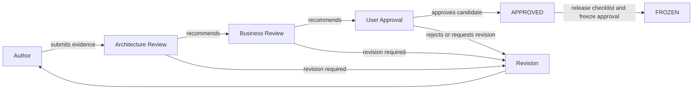

# Approval Workflow

| 항목 | 값 |
|---|---|
| Document ID | DOC-CORE-025 |
| 문서 버전 | v1.0 |
| 상태 | FROZEN |
| 소유 역할 | Architecture Owner |
| 기준일 | 2026-07-13 |

이 workflow는 Architecture Bible 문서, decision, change request와 release를 승인하는 역할·증거·거절·수정·긴급 절차를 정의한다. approval은 [Document Lifecycle](00_DOCUMENT_LIFECYCLE.md)의 status transition과 [Release Policy](00_RELEASE_POLICY.md)의 release gate에 연결된다.

## Approval chain

User Approval은 문서를 `APPROVED`로 만든다. `FROZEN` 전환은 같은 approval을 자동 재사용하지 않으며, manifest/checksum과 release checklist를 대상으로 별도의 freeze evidence가 필요하다.

## Roles and accountability

| 역할 | 책임 | 단독 승인 가능 여부 |
|---|---|---|
| Author | 문서 작성, self-review, validation과 response 제공 | 불가 |
| Architecture Review | 구조, consistency, ID, trace, risk, feasibility와 ADR 검토 | review release 접수만 가능 |
| Business Review | product scope, workflow, value, role와 policy 영향 검토 | 불가 |
| Specialist Review | Security/Privacy, AI, Database, Development 등 해당 영향 검토 | 자신의 분야 sign-off; 전체 승인 불가 |
| User Approver | 최종 scope/architecture candidate 승인 및 conflict resolution | `APPROVED` 전환 승인 가능 |
| Release Owner | manifest/checksum, release notes와 freeze evidence 확인 | User freeze approval 없이 `FROZEN` 불가 |

## Required approvals

| 대상 | Architecture | Business | Specialist | User | Freeze approval |
|---|---|---|---|---|---|
| Core governance/normative Book | Required | Required | 영향 분야 Required | Required | F1/release 시 Required |
| Security/privacy 문서 또는 변경 | Required | Required | Security/Privacy Required | Required | Required |
| AI authority/model 문서 또는 변경 | Required | Required | AI와 Security/Privacy Required | Required | Required |
| Data/database 문서 또는 변경 | Required | 영향 있으면 Required | Database와 Security/Privacy Required | Required | Required |
| Editorial patch | Architecture Owner triage | N/A with rationale | 영향 있으면 Required | 의미 불변이면 N/A with evidence | frozen baseline patch에는 Required |
| Completion report | Architecture completeness review | N/A | scope에 따라 | gate Brief에서 Required | N/A |

required approval을 `N/A`로 바꾸려면 [Review Checklist](00_REVIEW_CHECKLIST.md)에 reason과 Architecture Owner concurrence를 기록한다. author와 approver의 independence를 가능한 범위에서 유지한다.

## Approval evidence

모든 approval에는 다음을 기록한다.

- approval ID 또는 review record link
- 대상 Document ID, version, checksum 또는 immutable candidate reference
- approver identity와 role
- decision (`APPROVE`, `REJECT`, `REVISE`, `DEFER`)
- date/time과 scope
- conditions, dissent, accepted risk와 expiry
- 관련 CR, Decision ID, ADR, finding 및 release ID

chat 또는 verbal approval만 존재하면 Author가 durable review record로 옮기고 approver가 확인하기 전에는 final evidence로 간주하지 않는다.

## Standard workflow

1. Author가 required inputs와 self-review를 완료해 `IN REVIEW`를 요청한다.
2. Architecture Review가 completeness, consistency, impact와 specialist route를 확인한다.
3. specialist와 Business Review가 evidence 및 finding을 기록한다.
4. blocking finding이 모두 해결되면 User Approver에게 fixed candidate를 제출한다.
5. user가 승인하면 문서를 `APPROVED`로 전환하고 Version History/register를 갱신한다.
6. freeze 대상은 별도 release checklist, manifest/checksum과 freeze approval 후 `FROZEN`으로 전환한다.

## Rejected workflow

- reviewer는 rejection reason, severity, affected rule과 재제출 가능 여부를 기록한다.
- CR은 `REJECTED`, decision은 `REJECTED`로 전환하거나 문서는 `DRAFT`로 돌아간다.
- rejected artifact와 evidence를 삭제하지 않는다.
- 동일 proposal 재제출은 기존 ID를 연결하고 변경 내용을 명시한다. 본질적으로 다른 proposal이면 새 CR/decision ID를 발급한다.

## Revision workflow

- `REVISE` finding마다 owner, due condition과 affected Document ID/trace ID를 기록한다.
- normative content가 바뀌면 candidate version과 checksum을 갱신한다.
- 영향받은 reviewer는 변경 부분과 downstream effect를 재검토한다.
- 모든 finding이 resolved된 뒤 approval chain을 중단된 지점부터 재개하되, candidate identity가 바뀌면 이전 approval을 재사용하지 않는다.

## Urgent approval workflow

긴급 승인은 [Architecture Review Board](00_ARCHITECTURE_REVIEW_BOARD.md)의 emergency condition에만 사용한다.

1. incident/위험, scope, expiry, rollback과 우회할 수 없는 control을 기록한다.
2. Architecture Owner, relevant mandatory specialist와 Business Owner 또는 User Approver의 명시적 evidence를 얻는다.
3. 최소 reversible change만 provisional로 승인한다.
4. 1 business day 안에 CR/Decision ID를 만들고 2 business days 안에 full review를 수행한다.
5. retrospective에서 ratify, revise 또는 revoke하고 모든 register를 갱신한다.

urgent approval은 external publication human approval, verification, credential protection, provenance, audit 또는 role authorization을 면제하지 않으며 문서를 바로 `FROZEN`으로 전환할 수 없다.

## Phase 15 approval evidence

| Evidence item | Record |
|---|---|
| Fixed candidate | Phase 14 reviewed 247-document baseline plus four Phase 15 correction documents |
| Architecture review | DOC-REVIEW-021–025; APPROVE/KEEP OPEN dispositions |
| Corrections | CR-018; ACT-14-001–012; DOC-REVIEW-026 |
| User approval evidence | current explicit Phase 15 correction authorization, 2026-07-15 |
| Approved result | 250 documents `APPROVED` |
| Review exception | ADR-003 `IN REVIEW`; DEC-013/062/065 `UNDER_REVIEW` |
| Freeze result | not requested; no document is `FROZEN` |
| Validation | [Phase 15 Validation Report](reviews/PHASE15_VALIDATION_REPORT.md) |

> **OPEN DECISION:** User Approver와 각 specialist approver의 named primary/delegate, durable approval system과 electronic signature 수준은 D0/F1 전에 결정해야 한다. Classification: `OD-ROLE`/`OD-GOV`; Owner: User Approver; Target: D0 entry and F1; implementation/freeze blocking.
