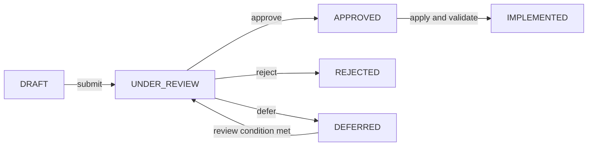

# Change Request Register

| 항목 | 값 |
|---|---|
| Document ID | DOC-CORE-021 |
| 문서 버전 | v1.3 |
| 상태 | FROZEN |
| 소유 역할 | Architecture Owner |
| 기준일 | 2026-07-13 |

이 register는 Architecture Bible, governance control과 향후 architecture baseline에 대한 모든 요청 변경을 접수하고 disposition까지 추적한다. 변경은 이 register에 기록됐다는 이유만으로 승인되지 않으며 [Architecture Review Board](00_ARCHITECTURE_REVIEW_BOARD.md)와 [Approval Workflow](00_APPROVAL_WORKFLOW.md)를 거쳐야 한다.

## Status와 필드 규칙

| 표시 상태 | Canonical value | 의미 |
|---|---|---|
| Draft | `DRAFT` | 작성 중이며 review 대상 아님 |
| Under Review | `UNDER_REVIEW` | impact 및 승인 검토 중 |
| Approved | `APPROVED` | 구현 허가됨; 아직 반영 완료가 아님 |
| Rejected | `REJECTED` | 근거와 함께 거절됨 |
| Implemented | `IMPLEMENTED` | 승인 범위가 문서에 반영되고 검증됨 |
| Deferred | `DEFERRED` | target phase/date와 재검토 조건을 두고 연기됨 |

| 필드 | 규칙 |
|---|---|
| CR ID | 다음 미사용 `CR-NNN`; 재사용 금지 |
| Priority | `CRITICAL`, `HIGH`, `MEDIUM`, `LOW` |
| Impact | product, document, security/privacy, trace, release 영향 요약 |
| Decision | 관련 `DEC-NNN`, `PENDING` 또는 rejection/defer 근거 |
| Related ADR | `ADR-NNN`, `NOT_REQUIRED`와 근거, 또는 `PENDING` |
| Approval Date | `APPROVED`/`IMPLEMENTED`일 때 `YYYY-MM-DD`; 그 외 `—` |

## Change request register

| CR ID | Title | Description | Requester | Reason | Priority | Impact | Affected Documents | Affected Phase | Status | Decision | Related ADR | Approval Date |
|---|---|---|---|---|---|---|---|---|---|---|---|---|
| CR-001 | Add documentation quality foundation | risk, assumption, naming, Document ID, Mermaid, review와 traceability control을 추가한다. | User | 모든 미래 Book의 공통 quality 기준 필요 | HIGH | governance와 review baseline 확장 | DOC-CORE-001, DOC-CORE-005, DOC-CORE-013–019 | A0.5 이후 | IMPLEMENTED | DEC-006, DEC-007 | NOT_REQUIRED — documentation governance foundation | 2026-07-13 |
| CR-002 | Add governance foundation | decision/change register, review board, release, lifecycle 및 approval control을 추가한다. | User | decision, change, review와 release의 영구 절차 필요 | HIGH | lifecycle에 `ARCHIVED` 추가, approval/release rule 확장 | DOC-CORE-001, DOC-CORE-005, DOC-CORE-020–025 | A0.6 이후 | IMPLEMENTED | DEC-008 | NOT_REQUIRED — user-directed governance scope | 2026-07-13 |
| CR-003 | Create Book 0 Project Constitution | Constitution과 mission/product/AI/data/security/development/decision/Done 원칙을 생성하고 최고 repository authority 후보로 review한다. | User | 모든 후속 Architecture Bible을 구속하는 명확한 project authority 필요 | HIGH | Book 1–12, ADR, roadmap, phase와 release precedence를 규정 | DOC-CORE-001, DOC-CORE-007, DOC-CORE-026–034 | A1 이후 | IMPLEMENTED | DEC-009 — UNDER_REVIEW | NOT_REQUIRED — founding Constitution requested by user | 2026-07-13 |
| CR-004 | Create Book 1 Business Strategy | business problem, persona, value, market context, scope, KPI와 long-term evolution을 정의한다. | User | internal Property Intelligence Platform에서 future cooperative MLS로의 business logic 필요 | HIGH | Book 2–12의 scope, priority, KPI와 roadmap input | DOC-BIZ-001–011 | A2 이후 | IMPLEMENTED | DEC-010 — UNDER_REVIEW | NOT_REQUIRED — business documentation scope | 2026-07-13 |
| CR-005 | Create Book 2 System Architecture | logical system/context/container/module/data/event/integration/failure/scalability architecture와 핵심 ADR을 정의한다. | User | Book 0 원칙과 Book 1 전략을 후속 설계가 참조할 system boundary로 전환 | HIGH | Book 3–12의 data, AI, workflow, API, security, operations 설계 기준 | DOC-ARCH-001–011, DOC-ADR-001–006, DOC-REVIEW-006 | A3 이후 | IMPLEMENTED | DEC-011–DEC-016 — UNDER_REVIEW | ADR-001–ADR-006 | 2026-07-13 |
| CR-006 | Create Phase 4 Database Architecture | complete logical data model, relationships, lifecycle, ownership, constraints, indexing과 governance를 문서화한다. | User | Book 2 data boundary를 후속 AI/workflow/API/security 설계가 참조할 logical database model로 전환 | HIGH | Book 4–12의 entity, authority, privacy, lifecycle와 traceability 기준 | DOC-DATA-001–016, DOC-REVIEW-007 | Phase 4 이후 | IMPLEMENTED | DEC-017–DEC-023 — UNDER_REVIEW | ADR-003 relevant; additional ADR triage pending | 2026-07-13 |
| CR-007 | Create Phase 5 AI Architecture | AI capability, provider abstraction, boundaries, validation, review, prompt governance, observability와 output schema를 문서화한다. | User | AI assistance를 Constitution/Book 3 authority와 privacy constraints 안에서 일관되게 정의 | HIGH | Book 5–12 workflow/API/UI/security/operations/test/development 기준 | DOC-AI-001–016, DOC-REVIEW-008 | Phase 5 이후 | IMPLEMENTED | DEC-024–DEC-030 — UNDER_REVIEW | ADR-006 relevant; additional ADR triage pending | 2026-07-14 |
| CR-008 | Create Phase 6 Workflow Architecture | discovery, intake, AI processing, duplicate, requirement, matching, verification, proposal, publication, expiration과 exception recovery lifecycle을 문서화한다. | User | Book 0–4 원칙과 data/AI boundaries를 auditable end-to-end workflow와 explicit authority transitions로 전환 | HIGH | Book 6–12 API/UI/security/operations/test/development의 workflow, state, approval와 recovery 기준 | DOC-WF-001–015, DOC-REVIEW-009 | Phase 6 이후 | IMPLEMENTED | DEC-031–DEC-037 — UNDER_REVIEW | ADR-004/005/006 relevant; additional ADR triage pending | 2026-07-14 |
| CR-009 | Create Phase 7 API & Integration Architecture | logical API, auth/session, background job, connector/external integration, error/versioning 및 capability registry 계약을 문서화한다. | User | Phase 0–6 requirements/workflows/entities/AI boundaries를 implementation-independent interface contracts로 전환 | HIGH | Phase 7.5/Book 7–12의 detailed contract, UI, security, operations, test와 development 기준 | DOC-API-001–017, DOC-REVIEW-010 | Phase 7 이후 | IMPLEMENTED | DEC-038–DEC-045 — UNDER_REVIEW | ADR-004/005/006 relevant; API/identity ADR triage pending | 2026-07-14 |
| CR-010 | Perform Phase 7.5 cross-phase consistency review | Book 0–6/ADR/registry/review의 terminology, status, entity, workflow, API, AI, naming, publication와 trace consistency를 검증하고 approved corrections를 적용한다. | User | Phase 8 전 cross-phase inconsistency와 orphan artifact 제거 | HIGH | Phase naming, Book 3/5/6 mappings, publication/audit states, registries와 future Phase 8 baseline | DOC-DATA-002–003, DOC-DATA-012, DOC-DATA-016, DOC-WF-001, DOC-WF-011, DOC-WF-014–015, DOC-API-004, DOC-API-006, DOC-API-010–011, DOC-API-017, DOC-REVIEW-011–014 | Phase 7.5 이후 | IMPLEMENTED | Existing DEC-003, DEC-019–021, DEC-031–045; no new architecture decision | NOT_REQUIRED — consistency-only correction | 2026-07-14 |
| CR-011 | Create Phase 8 UI/UX Architecture | information/navigation, role dashboards, logical screen catalog/specification, interaction standards, accessibility/state model과 Screen Registry를 문서화한다. | User | Phase 0–7.5의 workflow/entity/API/AI/authority 계약을 traceable user interaction으로 변환 | HIGH | Phase 9–13의 security, implementation, test와 delivery planning 기준 | DOC-UI-001–016, DOC-REVIEW-015 | Phase 8 이후 | IMPLEMENTED | DEC-046–050 — UNDER_REVIEW | NOT_REQUIRED — logical documentation scope; ADR triage pending | 2026-07-14 |
| CR-012 | Create Phase 9 Security & Privacy Architecture | Zero Trust, identity/authentication, authorization/permission, classification/privacy, audit/encryption/session/event/threat/logging/incident/backup와 Security Registry를 문서화한다. | User | Phase 0–8의 workflow/entity/API/UI/AI authority와 personal/security data를 complete logical control baseline으로 보호 | CRITICAL | Phase 10–13 operations/test/development/release security 기준과 mandatory review gate | DOC-SEC-001–016, DOC-REVIEW-016 | Phase 9 이후 | IMPLEMENTED | DEC-051–058 — UNDER_REVIEW | ADR-004/005 relevant; identity/security/privacy ADR triage pending | 2026-07-14 |
| CR-013 | Create Phase 10 Deployment & Operations Architecture | logical deployment/environment/configuration/release/runbook/monitoring/backup/DR/continuity/capacity/SLO/incident/change/security와 Operation Registry/Checklist를 문서화한다. | User | Phase 0–9 architecture/security authority를 verifiable, recoverable, auditable operational model로 전환 | CRITICAL | Phase 11–13 test/development/roadmap와 release/continuity baseline | DOC-OPS-001–016, DOC-REVIEW-017 | Phase 10 이후 | IMPLEMENTED | DEC-059–067 — UNDER_REVIEW | ADR-002/004/005 relevant; deployment/resilience ADR triage pending | 2026-07-14 |
| CR-014 | Create Phase 11 Test & Quality Architecture | quality strategy, requirement trace, test levels/data, functional/AI/security/performance/recovery/DR/UAT/release/defect/metrics와 Test Registry를 문서화한다. | User | Phase 0–10의 requirement, workflow, interface, AI, security와 operations를 release-gated validation evidence로 전환 | CRITICAL | Phase 12–13 development/roadmap와 R1/R2/F1 acceptance baseline | DOC-TEST-001–016, DOC-REVIEW-018 | Phase 11 이후 | IMPLEMENTED | DEC-068–075 — UNDER_REVIEW | Existing ADRs constrain tests; test automation/tool ADR pending | 2026-07-15 |
| CR-015 | Create Phase 12 Developer Bible | development principles, repository/coding/naming/module/Git/branch/trace/review/Ready/Done/debt/documentation/code-generation rules와 Developer Registry를 문서화한다. | User | Phase 0–11 architecture와 tests를 traceable, reviewable, human-owned implementation governance로 전환 | CRITICAL | Phase 13 roadmap, R1/R2/F1 review와 D0 development baseline | DOC-DEV-001–016, DOC-REVIEW-019 | Phase 12 이후 | IMPLEMENTED | DEC-076–083 — UNDER_REVIEW | Existing ADR-001–006 constrain development; stack/tooling/branch enforcement ADR triage pending | 2026-07-15 |
| CR-016 | Create Phase 13 Master Development Roadmap | implementation strategy, Epic/Feature/sequence/Sprint/Release/dependency/trace/risk/migration/cutover/go-live/post-live와 Release/Implementation Registry를 문서화한다. | User | Phase 0–12 Architecture Bible과 DEV-001–024를 complete implementation roadmap과 release gates로 전환 | CRITICAL | R1/R2/F1 review와 D0 implementation sequencing baseline | DOC-ROADMAP-001–016, DOC-REVIEW-020 | Phase 13 이후 | IMPLEMENTED | DEC-084–092 — UNDER_REVIEW | Existing ADR-001–006 constrain plan; stack/team/release/migration decisions pending | 2026-07-15 |
| CR-017 | Perform Phase 14 Architecture Review | Book 0–12, ADR, registry와 review의 consistency/traceability/quality/readiness를 검증하고 findings, recommendations와 action items를 기록한다. | User | Architecture Freeze 전 complete review와 correction-only Phase 15 input 필요 | CRITICAL | DOC-REVIEW-021–025, ACT-14-001–012와 freeze readiness | DOC-REVIEW-021–025 | Phase 14 이후 | IMPLEMENTED | No new architecture decision; review dispositions only | NOT_REQUIRED — verification and correction proposals only | 2026-07-15 |
| CR-018 | Execute Phase 15 Architecture Corrections | Phase 14의 ACT-14-001–012와 critical/major/minor findings만 교정하고 canonical trace/status/registry를 동기화한다. | User | Architecture Freeze 전 review findings closure 필요 | CRITICAL | Books 0–12 status, DOC-CORE-019/035, DEC/ADR/ASM/register/review evidence | DOC-CORE-001–035, DOC-ADR-001–006, DOC-REVIEW-021–028 | Phase 15 | IMPLEMENTED | DEC-093; Phase 14 APPROVE/KEEP OPEN dispositions | ADR-001/002/004/005/006 approved; ADR-003 remains IN REVIEW | 2026-07-15 |
| CR-019 | Freeze Architecture Bible v1.0 | 승인된 250-document candidate와 Phase 16 freeze evidence를 v1.0 baseline으로 동결하고 open exception을 보존한다. | User | Codex development 전 immutable architecture authority 필요 | CRITICAL | version/status metadata, freeze manifest/snapshot/trace/decision/open-item records와 future change control | DOC-CORE-001–035, DOC-ADR-001–006, DOC-FREEZE-001–008, DOC-REVIEW-001–030 | Phase 16 | IMPLEMENTED | DEC-094 — APPROVED | NOT_REQUIRED — freeze metadata/governance only | 2026-07-15 |
| CR-020 | Align Publication Approval with SP-008 | FEAT-014/DEV-014/IMP-014/API-013/TRACE-014와 Publication Approval workflow/UI/test ownership을 SP-008/REL-003으로 이동하고 기존 SP-008 RC stabilization scope를 SP-009로 이동한다. | Architecture Owner | SP-007 Permission Authority accepted baseline과 frozen roadmap ownership의 충돌 해소 | CRITICAL | Sprint/trace/release ownership correction; FEAT-015와 Production cutover Sprint assignment는 pending 유지 | DOC-CORE-007, DOC-CORE-020–021, DOC-CORE-035, DOC-ROADMAP-005–007, DOC-ROADMAP-015–016 | AO-017 | IMPLEMENTED | DEC-095 — APPROVED | NOT_REQUIRED — explicit Architecture Owner roadmap supersession; no product authority change | 2026-07-23 |
| CR-021 | Align Publication Representation ownership | FEAT-014의 Immutable Representation Snapshot과 FEAT-015의 Publication/Published Listing Projection ownership을 분리하고 API/UI/entity/test references를 정렬한다. | Architecture Owner | AO-018 accepted ownership을 frozen registries와 RTM에 durable하게 반영 | CRITICAL | Affected registries: trace/developer/feature/implementation/API/UI/test; affected RTM/entities: TRACE-014, Immutable Representation Snapshot, Publication, Published Listing Projection; no runtime implementation | DOC-CORE-020–021/035, DOC-API-017, DOC-UI-016, DOC-DEV-016, DOC-ROADMAP-004/016, DOC-TEST-003/016 | GOV-001 / AO-018 | IMPLEMENTED | DEC-096 — APPROVED | NOT_REQUIRED — existing ADR-004/007 authority is preserved | 2026-07-23 |
| CR-022 | Align Publication Target and Channel vocabulary | Publication Target를 FEAT-015-owned read-only dependency로 유지하고 target-scoped Channel, exact target/channel/policy/language/audience binding을 registry/UI/security/test trace에 반영한다. | Architecture Owner | AO-019 accepted vocabulary와 SP-008 approval scope 정렬 | CRITICAL | Affected registries: trace/API/UI/security/test; affected RTM/entities: Publication Target read dependency and Channel value object; no production target or connector selected | DOC-CORE-020–021/035, DOC-API-017, DOC-UI-016, DOC-SEC-016, DOC-TEST-003/016 | GOV-001 / AO-019 | IMPLEMENTED | DEC-097 — APPROVED | NOT_REQUIRED — target/provider selection remains deferred | 2026-07-23 |
| CR-023 | Complete API-013 governance contract | API-013 read/mutation surface, effective Approval and API-014 no-execution boundary를 canonical registry, UI, RTM와 tests에 반영한다. | Architecture Owner | AO-020 accepted contract와 WF-008/009 mapping 완결 | CRITICAL | Affected registries: API/UI/trace/test; affected API: API-013 only; API-014 ownership unchanged; no endpoint or runtime implementation | DOC-CORE-020–021/035, DOC-API-017, DOC-UI-016, DOC-TEST-003/016 | GOV-001 / AO-020 | IMPLEMENTED | DEC-098 — APPROVED | NOT_REQUIRED — logical contract refinement under existing ADRs | 2026-07-23 |
| CR-024 | Align Publication Approval SoD governance | actor-level conflict, role stacking, PUA authority, scheduler-only expiry, break-glass denial와 recovery/replay reauthorization을 security/test/UI/RTM mappings에 반영한다. | Architecture Owner | AO-021 accepted SoD rules를 SP-008 acceptance baseline으로 고정 | CRITICAL | Affected registries: security/test/UI/trace; affected tests: TEST-022 and TEST-033 SP-008 partition; no role, runtime authority or implementation change | DOC-CORE-020–021/035, DOC-UI-016, DOC-SEC-016, DOC-TEST-003/016 | GOV-001 / AO-021 | IMPLEMENTED | DEC-099 — APPROVED | NOT_REQUIRED — resolves ADR-004 open SoD detail without altering human-approval principle | 2026-07-23 |
| CR-025 | Align FEAT-015 Publication Event contract v2 | Runtime이 사용하는 Publication Event schema/contract v2와 Canonical Event Registry의 version metadata를 일치시키고, immutable Projection provenance의 승인 근거를 Decision/RTM evidence에 연결한다. | Architecture Owner | F15-TASK-011A가 `publicationVersion`, `targetReference`, `channelReference`를 immutable v2 provenance로 도입했으나 Registry가 v1로 남아 있던 mismatch 해소 | CRITICAL | DOC-CORE-020/021/050과 FEAT-015 traceability만 변경; Event authority, business lifecycle, physical serialization, Event Bus/Queue/Store 선택은 변경하지 않음 | DOC-CORE-020, DOC-CORE-021, DOC-CORE-050, FEAT015_TRACEABILITY_MATRIX | FEAT-015 Final Closure Remediation / FCR-004 | IMPLEMENTED | DEC-113 — APPROVED | NOT_REQUIRED — 현재 Brief의 explicit Architecture Owner decision을 durable governance evidence로 정렬 | 2026-08-12 |

## 처리 절차

1. Requester는 reason, impact, affected Document ID/phase와 priority를 작성한다.
2. Architecture Owner는 중복 여부, risk/assumption, trace impact와 ADR 필요성을 triage한다.
3. Architecture Review Board가 recommendation을 만들고 필요한 approval을 수집한다.
4. Author는 승인된 범위만 반영하고 link, ID, lifecycle, version 및 approval consistency를 검증한다.
5. `IMPLEMENTED` 전환 시 completion/review evidence를 연결한다.

긴급 변경도 register와 사후 review를 생략할 수 없으며 [Approval Workflow](00_APPROVAL_WORKFLOW.md)의 urgent rule을 따른다.
