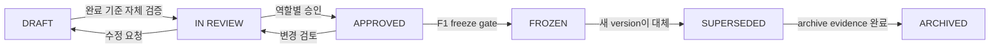

# Document Governance

| 항목 | 값 |
|---|---|
| Document ID | DOC-CORE-005 |
| 문서 버전 | v1.0 |
| 상태 | FROZEN |
| 문서 소유 역할 | Architecture Owner |
| 기준일 | 2026-07-13 |

이 문서는 mrHOMES AI MLS Architecture Bible의 소유권, 상태, 검토, 버전, 변경 통제와 동결 절차를 정의한다. 작업 규칙은 [AGENTS.md](../AGENTS.md), 탐색과 Document ID registry는 [Master Index](00_MASTER_INDEX.md)를 함께 따른다.

Architecture Owner는 문서 일관성과 release 준비를 책임지는 canonical governance role이다. 이 역할 정의는 Phase 15에서 ASM-006을 `RETIRED`하고 governance rule로 전환한 결과다.  
> **OPEN DECISION:** Architecture Owner, Product Approver, Security/Privacy Reviewer의 실명과 대리자는 implementation 시작 전 지정해야 한다. Owner: User Approver. Target: D0 entry gate. Classification: implementation-blocking, documentation approval non-blocking.

## 역할과 책임

| 역할 | 책임 | 승인 권한 |
|---|---|---|
| Document Author | 초안 작성, 상호 참조, 검증 증거와 변경 요약 제공 | 없음 |
| Architecture Owner | 구조·용어·추적성 관리, review 조정, version release 제안 | `IN REVIEW` 전환, review 결론 제안 |
| Business Owner / Product Approver | 제품 범위·업무 규칙 검토와 business concurrence | business review sign-off; User Approver에게 승인 recommendation |
| Security/Privacy Reviewer | contact, provenance, retention, access, audit 영향 검토 | 보안·개인정보 관련 승인 의견 |
| AI Reviewer | AI authority, validation, confidence와 provider 영향 검토 | AI 관련 승인 의견 |
| Database Reviewer | data integrity, provenance, retention와 recovery 영향 검토 | data/database 관련 승인 의견 |
| Development Reviewer | feasibility, dependency, test, operations와 rollback 검토 | development 관련 승인 의견 |
| User Approver | product/architecture candidate 및 freeze 최종 승인 | `APPROVED`와 release `FROZEN` 승인 |
| Change Proposer | 변경 요청과 ADR 제안 제출 | 없음 |

한 사람이 여러 역할을 맡을 수 있지만 작성자 단독으로 자신의 중요 architecture 결정을 승인할 수 없다.

## 상태 값

| 상태 | 의미 | 허용되는 다음 상태 |
|---|---|---|
| `DRAFT` | 작성 또는 수정 중이며 기준선이 아님 | `IN REVIEW` |
| `IN REVIEW` | 완전성·일관성·영향 검토 중 | `DRAFT`, `APPROVED` |
| `APPROVED` | 지정 approver가 승인한 현재 기준 | `IN REVIEW`, `FROZEN`, `SUPERSEDED` |
| `FROZEN` | v1.0 기준선에 포함되어 직접 수정 금지 | `SUPERSEDED` |
| `SUPERSEDED` | 새 문서 또는 ADR이 대체한 보존 기록 | `ARCHIVED` |
| `ARCHIVED` | active navigation에서 제외된 read-only historical artifact | 없음 |

문서 상단 metadata에 version, status, owner role, last updated를 표시한다. canonical state와 state별 edit/approval/exit rule은 [Document Lifecycle](00_DOCUMENT_LIFECYCLE.md)을 따른다. `SUPERSEDED` 문서는 대체 문서 링크를, `ARCHIVED` 문서는 archive location과 retention evidence를 반드시 포함한다.

## 검토 흐름

1. Author는 template, Glossary, [Naming Convention](00_NAMING_CONVENTION.md)과 [Document ID Rule](00_DOCUMENT_ID_RULE.md)을 적용하고 관련 문서를 연결한다.
2. Author는 [Risk Register](00_RISK_REGISTER.md)와 [Assumption Register](00_ASSUMPTION_REGISTER.md)에 새 위험·가정 또는 변경 영향을 반영하고 completion report에 읽은 문서, 변경, 결정, 불일치와 검증을 기록한다.
3. Architecture Owner는 [Review Checklist](00_REVIEW_CHECKLIST.md)를 사용해 완전성, 상호 참조, 용어, Document ID, Mermaid와 [end-to-end traceability](00_TRACEABILITY_RULE.md)를 확인한다.
4. [Architecture Review Board](00_ARCHITECTURE_REVIEW_BOARD.md)가 Business Owner와 필요한 전문 reviewer의 의견을 모아 recommendation을 남긴다.
5. [Approval Workflow](00_APPROVAL_WORKFLOW.md)의 required approval과 blocking finding이 해결되면 승인 주체·날짜·근거를 Version History와 register에 기록한다.
6. gate 대상 Brief는 사용자 승인 전 다음 gate-sensitive Brief로 진행하지 않는다.

## 버전 규칙

- version format, release class, major/minor/patch 판단과 archive는 [Release Policy](00_RELEASE_POLICY.md)를 따른다.
- 초안은 `v0.1`로 시작한다.
- v1.0 이전의 검토 반영은 필요 시 `v0.2`, `v0.3`처럼 minor를 올린다.
- `v1.0`은 Phase 14 Architecture Review(legacy alias `R1`), Phase 15 Architecture Corrections(legacy alias `R2`), F1 freeze 절차를 통과한 Architecture Bible 기준선이다.
- 동결 후 호환되는 설명·명확화는 review와 ADR 판단을 거쳐 `v1.x`, 원칙·경계·contract를 깨는 변경은 `v2.0` 후보로 관리한다.
- 문서 version 변경은 [Version History](00_VERSION_HISTORY.md)에 사유, 영향 파일, 승인 근거와 함께 기록한다.

## 변경 통제와 decision traceability

1. 모든 요청 변경은 [Change Request Register](00_CHANGE_REQUEST_REGISTER.md)에 CR ID로 등록하고 배경, 변경 내용, 영향 Document ID/trace ID, risk·assumption, 보안·개인정보 영향, migration/rollback 관점을 기록한다.
2. architecture 또는 비가역적 결정은 [ADR workflow](adr/README.md)를 사용하고 [Decision Register](00_DECISION_REGISTER.md)에 결과와 대체 관계를 기록한다.
3. 승인 문서 수정은 review로 되돌리고, 동결 문서는 직접 수정하지 않는다.
4. 동결 결정 변경은 새 ADR과 새 문서 version을 만들며, 이전 문서는 `SUPERSEDED`로 보존한다.
5. 상충을 발견하면 우선순위를 적용하되 조용히 덮어쓰지 않고 review report에 등록한다.
6. Architecture Review Board가 review와 voting/conflict 절차를 수행하며 User Approver의 최종 권한을 대체하지 않는다.

## 영구 품질 control

| Control | 사용 시점 | 필수 결과 |
|---|---|---|
| [Risk Register](00_RISK_REGISTER.md) | 계획, review, 변경 영향 분석 | risk ID, owner, mitigation, review date |
| [Assumption Register](00_ASSUMPTION_REGISTER.md) | 검증 전 전제를 사용할 때 | assumption ID, 반증 영향, validation phase/status |
| [Naming Convention](00_NAMING_CONVENTION.md) | 문서·model·contract·code identifier 제안 시 | artifact별 일관된 이름 |
| [Document ID Rule](00_DOCUMENT_ID_RULE.md) | 모든 문서 생성·이동·대체 시 | permanent unique ID와 Master Index 등록 |
| [Mermaid Style Guide](00_MERMAID_STYLE_GUIDE.md) | diagram 생성·review 시 | parse 가능하고 접근 가능한 일관된 diagram |
| [Review Checklist](00_REVIEW_CHECKLIST.md) | 모든 Book/control document review 시 | evidence가 있는 동일 quality gate 결과 |
| [Traceability Rule](00_TRACEABILITY_RULE.md) / [Canonical Traceability Matrix](00_CANONICAL_TRACEABILITY_MATRIX.md) | 중요 requirement 생성·변경·release 시 | requirement부터 test까지 양방향 trace와 zero orphan evidence |
| [Decision Register](00_DECISION_REGISTER.md) | 중요 decision 제안·승인·대체 시 | Decision ID, ADR, owner, status와 영향 추적 |
| [Change Request Register](00_CHANGE_REQUEST_REGISTER.md) | 모든 요청 변경 접수부터 구현까지 | CR ID, priority, impact, decision과 approval evidence |
| [Architecture Review Board](00_ARCHITECTURE_REVIEW_BOARD.md) | architecture/change/release review 시 | quorum, recommendation, dissent와 conflict record |
| [Release Policy](00_RELEASE_POLICY.md) | draft/review/frozen release와 archive 시 | version, checklist, notes, manifest/checksum |
| [Document Lifecycle](00_DOCUMENT_LIFECYCLE.md) | 모든 document state transition 시 | owner, allowed edit, approval과 exit evidence |
| [Approval Workflow](00_APPROVAL_WORKFLOW.md) | review, user approval와 freeze 시 | immutable candidate, approver, decision과 date |

`N/A`는 누락의 대체어가 아니며 [Review Checklist](00_REVIEW_CHECKLIST.md)에 이유를 기록해야 한다. 중요한 requirement에 trace ID가 없거나 document ID가 registry와 다르면 승인할 수 없다.

## v1.0 동결 규칙

v1.0 동결 전 다음 조건이 모두 필요하다.

- A0–A13 산출물과 completion report가 존재하고 필수 review gate를 통과한다.
- Phase 14(`R1`)에서 모든 문서를 검토하고 CRITICAL inconsistency가 없다.
- Phase 15(`R2`)에서 승인된 수정과 관련 ADR·version history를 반영한다.
- 모든 문서가 owner, status, version과 유효한 상호 링크를 가진다.
- 모든 문서가 영구 Document ID를 가지며 Master Index registry 및 freeze manifest와 일치한다.
- 모든 Book이 공통 Review Checklist를 통과하고 Mermaid diagram이 style acceptance rule을 충족한다.
- 모든 중요 requirement가 verified end-to-end trace를 가지며 open risk/assumption의 disposition이 기록된다.
- 모든 included decision/CR이 승인 또는 명시적으로 deferred/rejected되고 required ARB/user approval evidence가 있다.
- [Release Policy](00_RELEASE_POLICY.md)의 freeze checklist, release notes, manifest/checksum과 archive plan이 완료된다.
- unresolved critical decision이 없고, 수용된 미결정은 `POST-MVP` 또는 deferred로 명시된다.
- F1에서 최종 index, file manifest와 checksum, freeze record, 동결 후 change-control 문서를 만든다.
- 승인 대상 문서는 `v1.0 / FROZEN`으로 전환하고 승인자와 freeze date를 기록한다.

동결 뒤에는 manifest checksum과 다른 파일을 기준선으로 인정하지 않는다. 변경이 필요하면 change proposal → 영향 분석 → ADR/review → 승인 → 새 version → manifest 갱신 순서를 따른다.

## 문서 품질과 freeze 해제 금지

필수 heading, 깨진 링크, 정의되지 않은 핵심 용어, 숨은 `OPEN DECISION`, 검증되지 않은 사실, 승인 기록 누락이 있으면 승인 또는 동결할 수 없다. 단순 편집 변경도 동결 파일을 직접 덮어쓰지 않는다.
