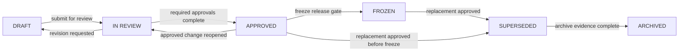

# Document Lifecycle

| 항목 | 값 |
|---|---|
| Document ID | DOC-CORE-024 |
| 문서 버전 | v1.0 |
| 상태 | FROZEN |
| 소유 역할 | Architecture Owner |
| 기준일 | 2026-07-13 |

이 문서는 Architecture Bible 문서의 생성부터 archive까지 canonical lifecycle을 정의한다. metadata에는 대문자 canonical status를 사용하며, 표시명은 Draft, In Review, Approved, Frozen, Superseded, Archived다.

## Canonical lifecycle

정상 maturity chain은 `DRAFT → IN REVIEW → APPROVED → FROZEN → SUPERSEDED → ARCHIVED`다. revision과 freeze 전 replacement를 위한 명시적 보조 transition만 허용한다. rejection은 lifecycle status가 아니라 review outcome이며 문서를 `DRAFT`로 돌려보내거나 change request를 `REJECTED`로 닫는다.

## State rules

| State | Purpose | Owner | Allowed edits | Approval requirement | Exit condition |
|---|---|---|---|---|---|
| `DRAFT` | 내용 작성, assumption 확인, 내부 collaboration | Document Author | 모든 in-scope edit; 변경 이력과 ID 유지 | 생성 승인 불필요; scope는 current brief/CR로 승인됨 | 필수 section, self-review, ID/link/risk/trace 검사가 완료되어 Architecture Owner가 review 접수 |
| `IN REVIEW` | 고정 version에 대한 architecture/business/specialist/user 검토 | Architecture Owner | finding 해결을 위한 controlled edit만; 의미 변경 시 version 갱신 또는 `DRAFT` 복귀 | [Approval Workflow](00_APPROVAL_WORKFLOW.md)의 reviewer evidence | blocking finding 해소와 required approval 완료 시 `APPROVED`; revision 요청 시 `DRAFT` |
| `APPROVED` | 승인된 현재 기준이자 freeze candidate | Architecture Owner | 직접 content edit 금지; 변경은 CR로 시작해 `IN REVIEW` 복귀 | Architecture, Business, required specialist, User Approval | release checklist/manifest를 통과해 `FROZEN`, 또는 승인된 replacement로 `SUPERSEDED` |
| `FROZEN` | 특정 release의 immutable architecture baseline | Architecture Owner/Release Owner | 직접 edit 금지; 새 version/Document ID와 CR·ADR로만 변경 | ARB recommendation, User freeze approval, manifest/checksum | 승인된 replacement가 release되면 `SUPERSEDED` |
| `SUPERSEDED` | 대체 문서가 있는 historical record | Architecture Owner | metadata의 replacement/archive link 외 content edit 금지 | 대체 document/decision approval evidence | archive location, retention, manifest와 replacement link가 확인되면 `ARCHIVED` |
| `ARCHIVED` | active navigation에서 제외된 read-only historical artifact | Records/Architecture Owner | edit 금지; 복원은 새 working copy로 수행 | archive policy와 retention 승인 | terminal state; legal hold/restore는 status를 되돌리지 않음 |

## Metadata requirements by state

| State | Additional metadata/evidence |
|---|---|
| `DRAFT` | Document ID, version, owner, date |
| `IN REVIEW` | review ID, candidate version, reviewer list |
| `APPROVED` | approvers, approval date, evidence link |
| `FROZEN` | release ID, freeze date, manifest/checksum |
| `SUPERSEDED` | `Superseded by`, replacement date, decision/ADR |
| `ARCHIVED` | archive location, retention class/date, manifest |

## Edit and correction rules

- `APPROVED` 또는 `FROZEN` content를 in-place 수정하지 않는다.
- patch 수준 정정도 CR, impact 판단과 새 version을 거친다.
- `IN REVIEW` 중 normative 의미가 바뀌면 review evidence가 가리키는 candidate를 갱신하고 affected reviewer에게 재검토를 요청한다.
- `SUPERSEDED`/`ARCHIVED`의 깨진 외부 link는 historical integrity를 해치지 않는 별도 redirect/index에서 보완한다.
- 모든 transition은 [Decision Register](00_DECISION_REGISTER.md), [Change Request Register](00_CHANGE_REQUEST_REGISTER.md), [Version History](00_VERSION_HISTORY.md) 중 관련 기록과 연결한다.

## Consistency with other statuses

document lifecycle status와 CR/decision/risk/assumption의 status namespace는 별개다. 예를 들어 CR의 `IMPLEMENTED`는 문서가 `FROZEN`임을 의미하지 않는다. 모든 문서 metadata에는 이 문서의 six canonical status만 사용한다.

> **OPEN DECISION:** Records/Architecture Owner의 named assignee와 physical archive retention class는 F1 전에 지정한다.
