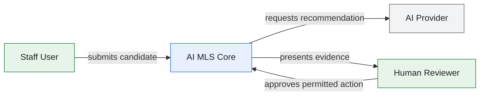
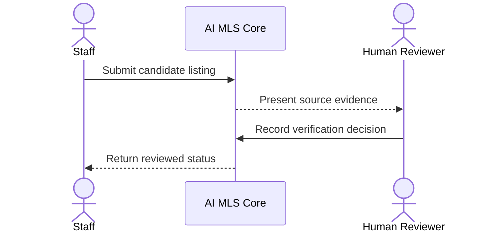
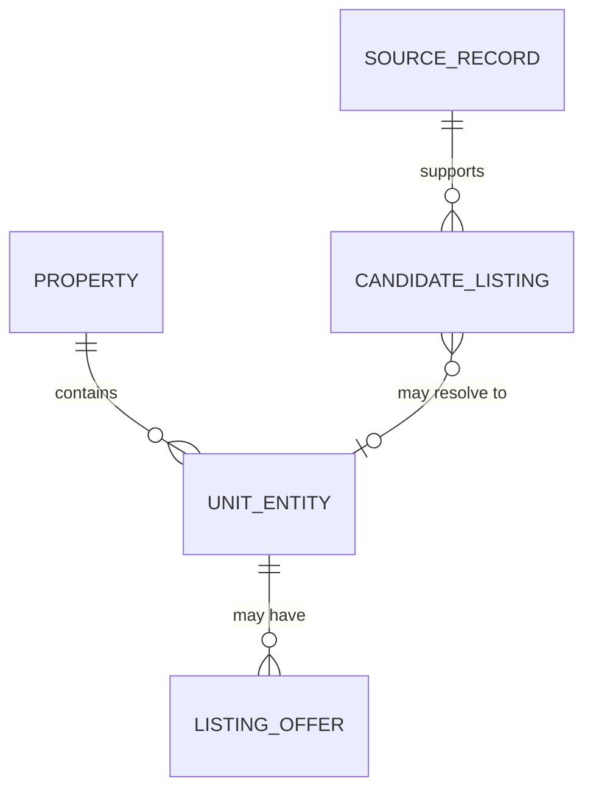
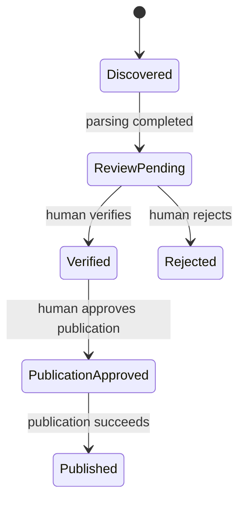

# Mermaid Style Guide

| 항목 | 값 |
|---|---|
| Document ID | DOC-CORE-017 |
| 문서 버전 | v1.0 |
| 상태 | FROZEN |
| 소유 역할 | Architecture Owner |
| 기준일 | 2026-07-13 |

이 guide는 Architecture Bible의 diagram을 일관되고 접근 가능하며 review 가능한 형태로 만든다. diagram은 본문 규칙을 보조하며, normative requirement를 diagram에만 두지 않는다. 용어는 [Glossary](00_GLOSSARY.md), 검사는 [Review Checklist](00_REVIEW_CHECKLIST.md)를 따른다.

## Allowed Diagram Types

| Type | 사용 목적 |
|---|---|
| `flowchart` | system boundary, component와 data flow |
| `graph` | 간단한 관계망; 새 문서는 가능하면 `flowchart` 사용 |
| `sequenceDiagram` | actor/service 간 시간 순 interaction |
| `erDiagram` | conceptual/logical entity relationship |
| `stateDiagram-v2` | lifecycle state와 transition (`stateDiagram` 계열) |
| `classDiagram` | type 또는 module의 static relationship |

다른 type이 필요하면 review report에 이유를 기록하고 Architecture Owner의 승인을 받는다.

## Naming Rules

- node ID는 짧고 안정적인 `PascalCase` English identifier를 사용한다: `ReviewQueue`.
- 표시 label은 Glossary 표준 용어를 사용하고 punctuation 또는 공백이 있으면 quote한다: `ReviewQueue["Human Review Queue"]`.
- actor, system, data store와 external boundary를 label로 명확히 구분한다.
- 같은 diagram 안에서 동일 대상은 동일 node ID와 label을 사용한다.
- 약어는 첫 사용에 풀어 쓰고 credential, contact 또는 실제 client/source data를 넣지 않는다.

## Direction

- system/context와 workflow 기본 방향은 `LR`이다.
- hierarchy 또는 긴 lifecycle은 `TB`를 사용할 수 있다.
- sequence는 왼쪽에서 오른쪽으로 actor → core → external dependency 순서를 권장한다.
- 역방향 edge를 남발하지 않고 correction/rollback은 label로 명시한다.

## Preferred Colors

색은 의미의 보조 수단이며 label, shape 또는 line style 없이 색만으로 상태를 구분하지 않는다.

| 의미 | Fill | Stroke | Text |
|---|---|---|---|
| Core/internal | `#E8F0FE` | `#1A73E8` | `#202124` |
| Human review/approval | `#E6F4EA` | `#188038` | `#202124` |
| External system | `#F1F3F4` | `#5F6368` | `#202124` |
| Warning/unverified | `#FEF7E0` | `#F9AB00` | `#202124` |
| Restricted/error | `#FCE8E6` | `#D93025` | `#202124` |

project-wide Mermaid theme override보다 diagram-local `classDef`를 사용하고 contrast를 유지한다. dark theme에서도 이해되도록 label을 반드시 둔다.

## Relationship Naming

- 모든 중요한 edge에 동작 또는 data 의미를 적는다: `-->|"submits candidate"|`.
- 모호한 `uses`, `processes`, `data`를 피하고 입력·결과를 구체적으로 쓴다.
- sequence message는 동사로 시작하며 response는 `-->>`를 사용한다.
- ERD cardinality와 relationship label을 모두 표시한다.
- state transition label은 trigger 또는 authorized action을 사용한다.

## Layout

- 한 diagram은 한 질문에 답하고 권장 node 수는 5–15개다. 20개를 넘으면 분할을 우선한다.
- crossing edge, 대각선 흐름과 긴 paragraph label을 최소화한다.
- legend가 필요하면 diagram 직후 표 또는 짧은 문장으로 둔다.
- source boundary, AI MLS core, human control과 external publication boundary를 시각적으로 분리한다.
- diagram 앞에는 목적, 뒤에는 핵심 해석과 예외를 텍스트로 제공한다.

## Examples

### System

### Workflow

### ERD

Conceptual example이며 final database schema를 확정하지 않는다.

### Lifecycle

위 lifecycle은 style example이며 Book 5의 최종 state dictionary가 아니다.

## Forbidden Styles

- 색만으로 verification, permission 또는 error를 표현
- Mermaid source 안에 raw HTML, JavaScript, click action 또는 external tracking link 삽입
- 실제 credential, contact, client 또는 restricted source content 표시
- AI에서 external publication으로 human approval 없이 직접 이어지는 edge
- 방향, label 또는 boundary가 없는 관계선
- 하나의 거대 diagram에 서로 다른 abstraction level 혼합
- text specification 없이 diagram만으로 normative rule 정의
- renderer-specific experimental syntax를 근거 없이 사용

## Acceptance Rules

| 검사 | 합격 조건 |
|---|---|
| Syntax | 지원 renderer에서 parse error가 없다. |
| Purpose | diagram 앞뒤 text가 질문과 해석을 설명한다. |
| Terminology | label이 Glossary 및 관련 문서와 일치한다. |
| Boundary | internal, human control, external system이 구분된다. |
| Direction | 주 흐름이 일관되고 edge label이 명확하다. |
| Accessibility | 색 외 label/shape가 있고 contrast가 충분하다. |
| Privacy/Security | restricted data와 credential이 없다. |
| Consistency | 본문 requirement/state/cardinality와 모순되지 않는다. |
| Size | review 가능한 크기이며 필요 시 분할했다. |

모든 Book review는 이 표와 [Review Checklist](00_REVIEW_CHECKLIST.md)를 사용한다.
