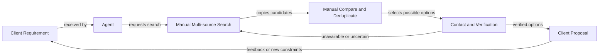

# Current Workflow Analysis

| 항목 | 값 |
|---|---|
| Document ID | DOC-BIZ-003 |
| 문서 버전 | v1.0 |
| 상태 | FROZEN |
| 소유 역할 | Business Owner |
| 기준일 | 2026-07-13 |
| Authority | [Project Constitution](../book-0/00_PROJECT_CONSTITUTION.md) |

> **ASSUMPTION [ASM-008]:** current workflow는 representative working model이며 named team의 observation으로 검증 전에는 company-wide measured fact가 아니다.

## Current workflow

| Step | Primary work | Input | Output/evidence |
|---|---|---|---|
| Requirement intake | need, budget, location, timing 확인 | message/call/note | interpreted client requirement |
| Search | source/channel별 candidate 탐색 | requirement | source references |
| Capture | 핵심 field와 contact 수동 정리 | source content | candidate notes |
| Compare | alias/duplicate/fit/staleness 판단 | candidate notes | review shortlist |
| Verification | availability, facts, permission 확인 | candidate/source/contact | verification evidence |
| Proposal | suitable verified option 설명 | verified listing | client-facing proposal |
| Follow-up | feedback, viewing, closing 결과 기록 | client/source responses | outcome/updated requirement |

## Current stakeholders

| Stakeholder | Current contribution | Authority boundary |
|---|---|---|
| Collector persona | source 탐색과 candidate capture | verification/publication 승인 불가 |
| Agent | requirement, matching, client communication | role 범위 내 sharing request |
| Senior Agent | complex case review와 coaching | delegated approval만 가능 |
| Manager | priority, quality, exception와 outcome review | business policy 범위 |
| Administrator | access/configuration support | business verification 대체 불가 |
| Owner/Broker/Developer | property/offer/source information 제공 | source evidence가 자동 verified truth는 아님 |
| Tenant/Buyer | requirement, feedback와 outcome 제공 | 자신의 consent/decision 범위 |

상세 persona는 [Target Users and Personas](03_TARGET_USERS_AND_PERSONAS.md)를 따른다.

## Current bottlenecks

- source마다 다른 search/navigation과 naming
- copied text에서 반복 field extraction
- same property/unit/offer 구분에 필요한 context 부족
- contact response 대기와 verification freshness
- requirement 변경 시 전체 재검색
- external proposal 전에 permission/evidence 재확인
- viewing/closing outcome이 source/candidate로 돌아오지 않는 feedback gap

## Current decision points

| Decision | Responsible role | Required evidence | Failure risk |
|---|---|---|---|
| candidate가 relevant한가? | Agent | client requirement와 source | missed/irrelevant option |
| duplicate인가, 별도 offer인가? | trained staff | property/unit/offer/source comparison | provenance loss 또는 double work |
| 현재 available한가? | authorized verifier | time-bound contact/source evidence | stale proposal |
| client에게 공유 가능한가? | authorized staff | verification + client-sharing permission | unauthorized sharing |
| publicly publishable한가? | authorized approver | verification + public-publication permission | unauthorized publication |
| follow-up priority는? | Agent/Manager | client urgency, fit, freshness | staff effort misallocation |

## Current risks

- [RISK-003](../00_RISK_REGISTER.md): duplicate detection failure
- [RISK-004](../00_RISK_REGISTER.md): publication without approval
- [RISK-005](../00_RISK_REGISTER.md): provenance loss
- [RISK-009](../00_RISK_REGISTER.md): credential/contact exposure
- [RISK-010](../00_RISK_REGISTER.md): data retention violation
- unmeasured additional risks: staff knowledge concentration, inconsistent correction, response delay와 stale shortlist

## Future workflow overview

미래 workflow는 “automation replaces staff”가 아니라 “system preserves context; staff decides”로 전환한다.

1. structured client requirement와 original wording을 함께 보존한다.
2. candidate/source를 한 번 capture하고 AI-assisted parsing을 human-correct한다.
3. property/unit/offer normalization과 duplicate suggestion을 review한다.
4. explainable match result로 search priority를 정한다.
5. authorized human이 verification/freshness와 permission을 기록한다.
6. verified, permitted option만 proposal/publication gate로 이동한다.
7. client feedback, viewing/closing과 source contribution을 measurement loop로 연결한다.

## Workflow transition guardrails

- manual intake fallback을 유지한다.
- low-confidence/exception queue에 owner와 SLA를 둔다.
- no state bypass for verification/permission/approval.
- automation benefit은 [Success Metrics](09_SUCCESS_METRICS.md)로 검증한다.
- detailed state, role, data와 interface는 Book 3–8에서 정의하며 이 문서는 구현 contract가 아니다.
