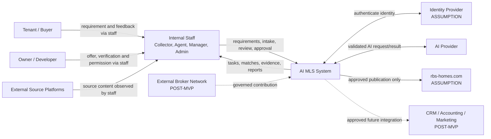

# Context Architecture

| 항목 | 값 |
|---|---|
| Document ID | DOC-ARCH-003 |
| 문서 버전 | v1.0 |
| 상태 | FROZEN |
| 소유 역할 | Architecture Owner |
| 기준일 | 2026-07-13 |
| Authority | [Project Constitution](../book-0/00_PROJECT_CONSTITUTION.md) |

## System Context Diagram

## Actors

| Actor | Primary interaction | Authority |
|---|---|---|
| Collector persona | approved source discovery/manual intake | candidate capture; no verification/publication approval |
| Agent | requirement, match review, client proposal/follow-up | role-limited client workflow |
| Senior Agent/Manager | exception, quality, workload, delegated review | approved business scope only |
| Administrator | identity/config/audit operations | no business verification substitution |
| Tenant/Buyer | requirements, feedback, viewing/decision | personal decision/consent only; mediated MVP access |
| Owner/Developer | offer, facts, permission/evidence | source authority subject to verification |
| Future External Broker | governed contribution/cooperation | POST-MVP membership scope |

## External systems

- source platforms: data origin/policy boundary; MVP uses manual observation/intake
- identity provider: authentication boundary, not authorization policy owner
- AI provider: untrusted advisory compute boundary
- rbs-homes.com: external publication target; contract is unconfirmed assumption
- notification service: delivery channel, not task/state authority
- future CRM/accounting/marketing/memory gateway/connectors: POST-MVP integrations

## Boundary definition

AI MLS system boundary begins when an authorized actor or approved connector submits data through intake/authentication contract. It ends at an explicit external integration adapter. Browser/session, provider, source site, customer messaging and published website are outside core even when operated by mrHOMES.

## Trust boundary

| Boundary | Treat as untrusted | Required controls |
|---|---|---|
| Human session → Core | request/identity claims until verified | authentication, authorization, validation, CSRF/session controls, audit |
| Source content → Intake | malformed, stale, malicious, policy-restricted | policy check, size/type validation, provenance, quarantine |
| Core → AI Provider | sensitive/over-broad prompt risk | minimization, redaction, provider policy, correlation/version |
| AI Provider → Core | malformed/hallucinated/injected result | schema/semantic validation, confidence, human review |
| Core → rbs-homes | duplicate/unauthorized publication | verification, permission, approval, idempotency, audit |
| Connector → Core | compromised/high-volume input | isolated credential, scoped intake only, rate/quota, revoke, audit |
| Core → future partner | data leakage/contract drift | allowlist contract, field authorization, version/retry/audit |

## External exposure rule

Customer와 public channel은 candidate listing에 직접 접근하지 않는다. external representation은 authorized core workflow가 valid verification, correct permission, approval와 provenance를 확인한 뒤 생성한다.

> **OPEN DECISION:** customer direct portal, confirmed identity provider와 rbs-homes integration contract는 각각 후속 UI/integration/operations review에서 결정한다.
