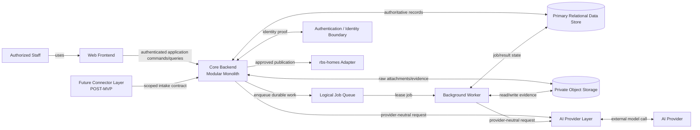

# Container Architecture

| 항목 | 값 |
|---|---|
| Document ID | DOC-ARCH-004 |
| 문서 버전 | v1.0 |
| 상태 | FROZEN |
| 소유 역할 | Architecture Owner |
| 기준일 | 2026-07-13 |
| Authority | [Project Constitution](../book-0/00_PROJECT_CONSTITUTION.md) |

이 문서의 container는 logical runtime/data responsibility다. cloud vendor, process count, network/subnet, region 또는 deployment product를 지정하지 않는다.

## Container Diagram

## Logical containers

| Container | Responsibility | Owned state/authority | Must not do |
|---|---|---|---|
| Web Frontend | role-aware staff experience, input and evidence presentation | ephemeral UI/session state only | authoritative validation 또는 hidden permission bypass |
| Core Backend | modular business rules, commands/queries, authorization, transaction/audit orchestration | authoritative business state changes | provider-specific AI logic or collector account control |
| Background Worker | asynchronous parse/rematch/retention/retry/reverification execution | leased job progress; business transition only through modules | bypass validation/authorization/publication gates |
| Logical Job Queue | durable scheduling, lease, retry/dead-letter semantics | job delivery metadata | business source of truth |
| Primary Relational Data Store | authoritative structured records, history, audit references | canonical structured persistence | raw external authority inference |
| Private Object Storage | raw attachment/evidence object with retention/access metadata | binary/raw evidence | unrestricted public serving |
| AI Provider Layer | prompt/provider abstraction, validation envelope, observability | prompt/provider config and result metadata per policy | approval/authoritative write |
| Authentication/Identity Boundary | human/service identity proof and session/token lifecycle | identity evidence | business authorization decision alone |
| rbs-homes Adapter | approved publication command/status reconciliation | external link/reference and integration attempt | choose publishable record or permission |
| Future Connector Layer | permitted source acquisition and scoped intake | connector-local checkpoint/health | core DB/private module/publication direct access |

## Interaction rules

- Frontend accesses Core Backend only; direct DB/storage/AI calls are prohibited.
- Worker uses the same application module rules as synchronous commands.
- Queue delivery is at-least-once compatible; handlers require idempotent business guards.
- AI Layer returns validated advisory result; Backend/Worker persists only after application validation.
- storage access uses short-lived/scoped application mediation; contact/raw evidence is private by default.
- connector communicates through a versioned intake boundary and can be disabled independently.

## Authentication vs authorization

Authentication establishes identity. Core Authorization module decides allowed action/resource/state/scope. External identity provider claims never directly grant publication or restricted contact access.

## Data store decision status

PostgreSQL is preferred in [ADR-003](../adr/ADR-003-POSTGRESQL-PREFERRED.md), but this Book only requires a transactional relational capability. final schema, extension, managed provider와 deployment는 Phase 4/A9에서 결정한다.

## MVP and future boundary

MVP may run Backend and Worker from the same codebase while maintaining separate logical runtime/failure responsibilities. Future service extraction must follow [Scalability Strategy](09_SCALABILITY_STRATEGY.md) rather than splitting containers by noun alone.
