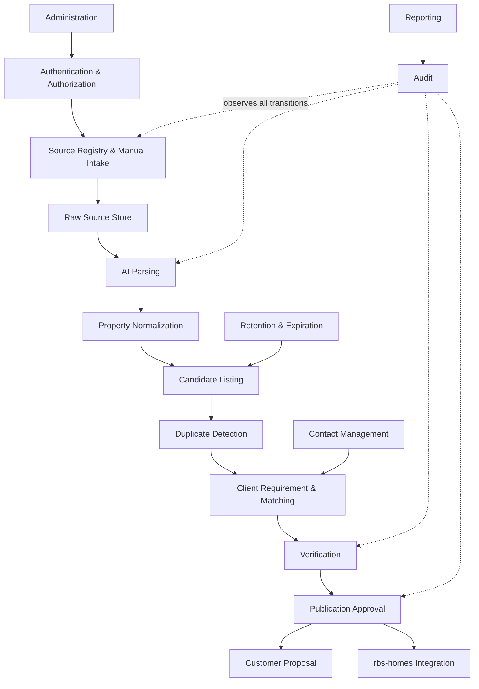

# Module Architecture

| 항목 | 값 |
|---|---|
| Document ID | DOC-ARCH-005 |
| 문서 버전 | v1.0 |
| 상태 | FROZEN |
| 소유 역할 | Architecture Owner |
| 기준일 | 2026-07-13 |
| Authority | [Project Constitution](../book-0/00_PROJECT_CONSTITUTION.md) |

이 문서는 Core Backend와 Background Worker가 공유하는 논리 모듈 경계를 정의한다. 모듈은 코드 패키지나 독립 서비스의 확정안이 아니며, 책임·권한·의존성 검토 단위이다.

## Module Diagram

## Module responsibilities

| Module | Purpose | Responsibilities | Inputs | Outputs | Dependencies |
|---|---|---|---|---|---|
| Authentication | 주체의 신원을 확인한다. | 사용자·서비스 신원 증명, 세션 수명주기, 인증 실패 기록 | identity evidence | authenticated principal 또는 실패 | external identity boundary, Audit |
| Authorization | 주체가 특정 자원과 상태에서 수행 가능한 행동을 판단한다. | 역할·범위·상태 기반 정책 평가, 기본 거부 | principal, action, resource context | allow/deny decision with reason | Authentication, Administration, Audit |
| Source Registry | 정보 출처와 허용 정책을 관리한다. | 출처 식별, 소유자·수집 방식·허용 범위·상태 기록 | approved source definition | active source policy | Authorization, Administration, Audit |
| Manual Intake | 사람이 제공한 원문과 맥락을 접수한다. | 입력 검증, 출처 연결, 접수 추적, 후속 작업 요청 | staff input, source reference, evidence | intake record, parse request | Authorization, Source Registry, Raw Source Store, Audit |
| Raw Source Store | 원본 증거를 비공개로 보존한다. | 원문·첨부 참조, 접근·보존 메타데이터, 무결성 연결 | raw text/file/evidence | immutable evidence reference | Authorization, Retention and Expiration, Audit |
| AI Parsing | 원문에서 후보 구조를 제안한다. | provider-neutral 요청, 결과 유효성 검사, confidence·provenance 연결 | evidence reference, parsing intent | advisory parse result | Raw Source Store, AI Provider Layer, Audit |
| Property Normalization | 표현 차이를 canonical 후보 형식으로 정규화한다. | 형식·단위·주소 표현 정규화, 불확실성 보존 | advisory parse or manual fields | normalized candidate attributes | AI Parsing, Glossary, Audit |
| Candidate Listing | 검증 전 매물 후보의 수명주기를 관리한다. | 후보 생성·수정·상태 전이, provenance 유지 | normalized attributes, source evidence | candidate listing | Property Normalization, Authorization, Audit |
| Duplicate Detection | 동일 가능성이 있는 후보를 제안한다. | 유사 후보 탐색, 근거·confidence 제공, 사람의 병합 판단 지원 | candidate attributes, existing candidates | duplicate suggestions | Candidate Listing, Audit |
| Client Requirement | 고객 요구사항을 명시적으로 관리한다. | 조건·우선순위·유효기간·동의 범위 기록 | authorized staff input, client context | active requirement profile | Contact Management, Authorization, Audit |
| Matching | 요구사항과 후보의 적합성을 계산·설명한다. | 후보 검색, ranking, explanation, 재매칭 요청 | active requirements, eligible candidates | shortlist suggestions | Client Requirement, Candidate Listing, Audit |
| Contact Management | 연락 주체와 공유 동의 범위를 관리한다. | 최소 연락 정보, 관계·동의·접근 범위 관리 | authorized contact input | scoped contact context | Authorization, Audit |
| Verification | 후보 사실과 최신성을 사람이 검토하도록 통제한다. | 증거 검토, 필수 확인, 반려·재검증, 검증 기록 | candidate, evidence, reviewer action | verified/rejected/revision-required decision | Candidate Listing, Raw Source Store, Authorization, Audit |
| Publication Approval | 외부 공유·게시를 위한 별도 사람 승인을 집행한다. | publishability 점검, 승인·거절, 대상 채널 범위 결정 | verified record, approver action | approved publication command or denial | Verification, Authorization, Audit |
| Customer Proposal | 승인된 범위에서 고객용 제안을 구성한다. | 허용 필드 선별, 제안 이력, 만료·철회 반영 | matched candidates, sharing permission | client-scoped proposal | Matching, Publication Approval, Contact Management, Audit |
| rbs-homes Integration | 승인된 게시 명령을 외부 경계로 전달하고 상태를 조정한다. | 계약 변환, 전송, 결과 reconciliation, 중복 방지 | approved publication command | external reference/status | Publication Approval, Integration boundary, Audit |
| Retention and Expiration | 데이터와 후보의 유효기간 정책을 적용한다. | 만료 탐지, 재검증 예약, 보존·삭제 요청 통제 | lifecycle policy, timestamps, legal/business hold | expiration/reverification actions | Administration, Audit |
| Reporting | 운영·품질·추적 지표를 제공한다. | 승인된 집계, lineage 기반 보고, 민감정보 최소화 | audit and authorized business views | reports and KPI views | Authorization, Audit |
| Administration | 정책성 설정과 역할 할당을 관리한다. | 역할·정책·source configuration의 통제된 변경 | administrator action | versioned configuration | Authentication, Authorization, Audit |
| Audit | 모든 중요한 행동과 결정의 추적성을 보존한다. | actor·time·action·reason·before/after reference 기록, 조회 통제 | domain and security events | append-oriented audit evidence | Authentication context, authoritative data store |

## Dependency rules

- Frontend, Worker, adapter는 공개된 application boundary만 호출하며 모듈 저장소를 직접 우회하지 않는다.
- AI Parsing, Duplicate Detection, Matching은 제안 권한만 가지며 검증·게시 상태를 직접 변경하지 않는다.
- Publication Approval은 Verification을 건너뛸 수 없고, integration adapter는 Publication Approval을 건너뛸 수 없다.
- Audit 실패 시 고위험 상태 전이는 완료된 것으로 간주하지 않는 방향으로 설계한다. 구체적 transaction 전략은 후속 설계 대상이다.
- 순환 의존성은 domain event 또는 명시적 orchestration boundary로 해소하되, 특정 event bus 제품을 전제하지 않는다.
- 향후 서비스 분리는 [Scalability Strategy](09_SCALABILITY_STRATEGY.md)의 추출 기준을 충족할 때만 검토한다.

## Non-goals

이 문서는 클래스, 함수, table, endpoint, message schema, repository layout을 정의하지 않는다.

