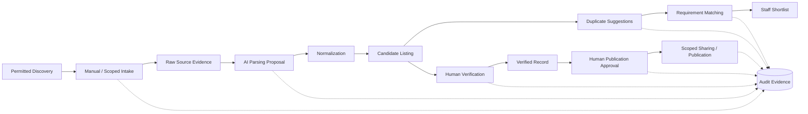

# Data Flow Architecture

| 항목 | 값 |
|---|---|
| Document ID | DOC-ARCH-006 |
| 문서 버전 | v1.0 |
| 상태 | FROZEN |
| 소유 역할 | Architecture Owner |
| 기준일 | 2026-07-13 |
| Authority | [Project Constitution](../book-0/00_PROJECT_CONSTITUTION.md) |

## Main Data Flow

## Flow stages

| Stage | Input | Processing responsibility | Output | Human control |
|---|---|---|---|---|
| Discovery | permitted source reference | source policy 확인 | discovery reference | 출처 허용 정책 승인 |
| Manual/scoped intake | source context and raw content | validation, provenance capture | intake and evidence reference | 직원이 접수 맥락 확인 |
| AI parsing | raw evidence | provider-neutral extraction and validation | advisory structured proposal | 낮은 confidence·오류 수정 |
| Normalization | parsed or manual proposal | canonical expression with uncertainty retained | normalized candidate attributes | 중요한 불확실성 확인 |
| Candidate creation | normalized attributes and evidence | candidate lifecycle entry | candidate listing | 권한 있는 직원만 수정 |
| Duplicate detection | candidate set | similarity assessment | duplicate suggestion with reasons | 병합·분리 판단은 사람 |
| Matching | eligible candidates and active requirement | ranking and explanation | shortlist suggestion | 직원이 고객 제안 후보 선택 |
| Verification | candidate, evidence, freshness | fact and availability review | verified/rejected/revision-required result | 지정 reviewer 승인 필수 |
| Publication approval | verified record and target scope | publishability and privacy check | scoped publication command | 지정 approver 승인 필수 |
| Publication/reconciliation | approved command | adapter delivery and status reconciliation | external reference or recoverable failure | 철회·재게시 정책 통제 |

## Information authority boundaries

- Source evidence는 “외부에 존재했던 내용”의 증거이며 사실의 자동 보증이 아니다.
- Candidate Listing은 조사·정규화된 후보이며 Verified Record나 Published Listing과 동일하지 않다.
- Verified는 사실 검토 결과이고, Published는 특정 대상·채널에 공유하도록 별도 승인된 결과이다.
- Client-scoped sharing permission과 public publication permission은 분리한다.
- AI output, match score, duplicate score는 advisory data이며 스스로 authoritative state transition을 일으키지 않는다.
- 연락처와 원문 증거는 private by default이며 출력 흐름마다 최소 필요 필드만 허용한다.

## Provenance and audit flow

각 파생 결과는 가능한 범위에서 source evidence, 변환 단계, actor 또는 job, 정책 버전, 발생 시각, 사람 결정을 연결한다. Audit evidence는 사업 데이터의 복제본이 아니라 누가 무엇을 왜 변경했는지 검증 가능한 참조를 제공한다. 세부 field와 retention period는 Book 3과 Book 8의 후속 결정이다.

## Error and revision flow

- parsing/normalization 오류는 원문을 덮어쓰지 않고 revision으로 되돌린다.
- duplicate 판단 변경은 후보의 provenance를 보존한다.
- 검증 반려는 Candidate로 되돌아가며 게시 승인을 무효화한다.
- 게시 후 중요한 사실 변경이나 만료는 외부 상태 reconciliation과 재검증을 요구한다.
- retry는 동일 business operation의 중복 게시나 중복 상태 전이를 만들지 않아야 한다.

## Boundaries deferred

구체적 entity, field, state enum, transaction, message payload, API contract는 이 문서의 범위가 아니다.

