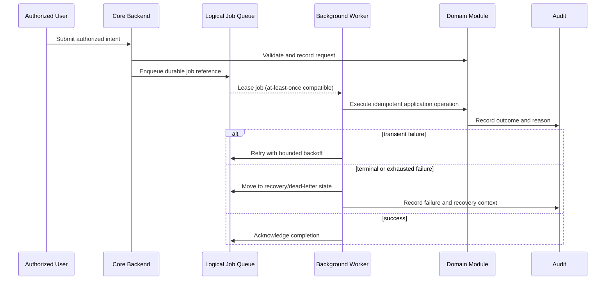

# Event and Job Architecture

| 항목 | 값 |
|---|---|
| Document ID | DOC-ARCH-007 |
| 문서 버전 | v1.0 |
| 상태 | FROZEN |
| 소유 역할 | Architecture Owner |
| 기준일 | 2026-07-13 |
| Authority | [Project Constitution](../book-0/00_PROJECT_CONSTITUTION.md) |

이 문서는 장시간·재시도 가능 작업을 요청 처리에서 분리하는 논리 모델을 정의한다. 특정 queue, scheduler, event bus 제품을 선택하지 않는다.

## Event Flow

## Job categories

| Category | Trigger | Responsibility | Failure posture |
|---|---|---|---|
| Parsing | accepted intake | raw evidence를 advisory parse로 변환 | 원문 보존, 수정 또는 재시도 가능 |
| Normalization/rematching | parse·candidate·requirement change | 파생 후보와 shortlist 갱신 | 기존 authoritative decision 유지 |
| Duplicate assessment | candidate change | 중복 제안 재계산 | 사람 판단을 자동 변경하지 않음 |
| Publication delivery | explicit approved command | 대상 integration으로 전달 및 reconcile | fail closed, 중복 게시 방지 |
| Expiration | policy schedule | 만료 후보 탐지 및 상태 검토 요청 | 자동 공개 연장 금지 |
| Reverification | freshness threshold or material change | reviewer 작업 생성 | 과거 검증을 조용히 갱신하지 않음 |
| Notification | auditable domain outcome | 적절한 수신자에게 후속 필요 알림 | business state와 분리, 재전송 가능 |
| Reporting | approved schedule/request | privacy-scoped 집계 갱신 | 운영 흐름 차단 금지 |

## Delivery and retry rules

- delivery는 at-least-once 상황을 견디도록 operation identity와 business guard를 사용한다.
- transient failure만 bounded retry 대상이며 backoff와 attempt history를 남긴다.
- validation, authorization, revoked approval 같은 terminal failure는 자동 반복하지 않는다.
- retry 한도 초과 작업은 격리된 recovery/dead-letter 상태로 이동하고 원인·영향·재개 권한을 기록한다.
- 재실행은 원 작업을 추적하며 동일한 외부 publication이나 authoritative transition을 중복 생성하지 않아야 한다.
- Queue는 전달 상태를 소유할 뿐 business source of truth가 아니다.

## Scheduling and lifecycle

Scheduler는 expiration, reverification, reconciliation, policy-driven reporting을 요청한다. 시간 기준과 보존 기간은 각 정책의 version을 참조해야 하며, scheduler failure가 곧 business data 변경으로 간주되지 않는다.

## Audit and notification events

Audit event는 actor/job, action, target reference, result, reason, correlation, policy/version 맥락을 표현한다. Notification event는 사용자 경험을 위한 파생 신호로서 audit evidence를 대체하지 않는다. 민감한 원문과 연락처를 event payload에 불필요하게 복제하지 않는다.

## Future event bus

Growth 단계에서 여러 독립 consumer, 명확한 소유 경계, 높은 비동기 처리량 또는 독립 장애 격리가 필요해질 때 domain event transport 분리를 검토할 수 있다. 현재 문서는 in-process event와 외부 event bus 중 어느 것도 확정하지 않는다.

## Deferred details

Event name catalog, payload schema, partitioning, retention, ordering guarantee, queue vendor와 운영 수치는 후속 설계·ADR 대상이다.

