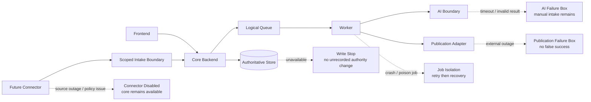

# Failure Isolation

| 항목 | 값 |
|---|---|
| Document ID | DOC-ARCH-009 |
| 문서 버전 | v1.0 |
| 상태 | FROZEN |
| 소유 역할 | Architecture Owner |
| 기준일 | 2026-07-13 |
| Authority | [Project Constitution](../book-0/00_PROJECT_CONSTITUTION.md) |

## Failure Isolation Diagram

## Failure principles

- 위험한 상태 전이는 fail closed 한다. 검증·승인·audit이 불명확하면 게시 성공으로 취급하지 않는다.
- 외부·비동기 실패는 core authoritative data와 별도 상태로 격리한다.
- 오류를 숨기지 않고 correlation, attempt, cause category, 영향, recovery owner를 추적한다.
- 자동 retry는 안전한 transient failure에만 적용하고, 사람 판단이나 revoked permission을 되살리지 않는다.
- 복구 경로는 중복 실행을 견디며 원래 provenance와 승인을 보존한다.

## Scenario controls

| Scenario | Isolation boundary | User-visible behavior | Recovery | Prohibited outcome |
|---|---|---|---|---|
| Worker unavailable | queue lease와 worker runtime | 동기 core 기능은 가능 범위에서 유지, 비동기 작업 pending 표시 | worker 재개 후 lease/retry, backlog 검토 | 작업 유실 또는 완료로 오표시 |
| Poison/repeated job | per-job recovery/dead-letter state | 해당 작업만 실패·검토 필요 | 원인 수정 후 권한 있는 replay | 전체 queue 중단, 무한 retry |
| AI provider timeout/outage | provider-neutral AI boundary | manual intake/edit/verification 경로 유지 | bounded retry 또는 provider 전환 검토 | AI 결과를 fabricated success로 처리 |
| AI invalid/unsafe result | validation envelope | 제안 거절 또는 사람 수정 요청 | 원문 기반 재처리 | authoritative write나 자동 승인 |
| Primary data store unavailable | transaction boundary | 변경 요청 실패/보류, 명확한 오류 | store 복구와 일관성 점검 | audit 없는 상태 변경 |
| Object evidence unavailable | evidence access boundary | 검증·게시 중단, 기존 출처 참조 오류 표시 | storage 복구/무결성 확인 | 증거 없이 검증 성공 |
| Connector failure/policy issue | connector process/credential/source | 해당 source intake 중단 | connector disable, checkpoint 검토 | core 장애 또는 승인 gate 우회 |
| Publication endpoint unavailable | publication adapter | pending/failed, 외부 게시 성공으로 표시 금지 | idempotent retry와 reconciliation | 중복 게시 또는 false success |
| Ambiguous publication response | reconciliation boundary | 상태를 unknown/pending review로 노출 | 외부 조회 또는 운영 확인 | 추측으로 Published 전환 |
| Notification/reporting failure | derived-output boundary | 사업 상태는 유지, 알림 지연 표시 | 독립 retry | authoritative transaction rollback 남용 |
| Authorization/audit subsystem uncertainty | security/governance boundary | 고위험 작업 거부 | 정책·audit 가용성 복구 | privilege 확대 또는 추적 불가 변경 |

## Publication safety

게시 요청의 승인 증거가 없거나 만료·철회되었으면 adapter 전송을 거부한다. timeout 후에는 같은 operation identity로 외부 상태를 먼저 reconcile하고, 확인되지 않은 상태에서 새 게시를 생성하지 않는다.

## Data recovery posture

복구는 authoritative record, raw evidence, audit linkage의 일관성을 우선한다. 목표 복구시간, 백업 주기, 재해복구 topology는 Book 9에서 결정하며 현재 단계에서는 수치를 약속하지 않는다.

## Validation scenarios for later phases

후속 품질 문서는 worker crash, duplicate delivery, provider timeout, invalid AI output, store outage, connector credential revocation, ambiguous publication response, audit failure를 testable scenario로 변환해야 한다.

