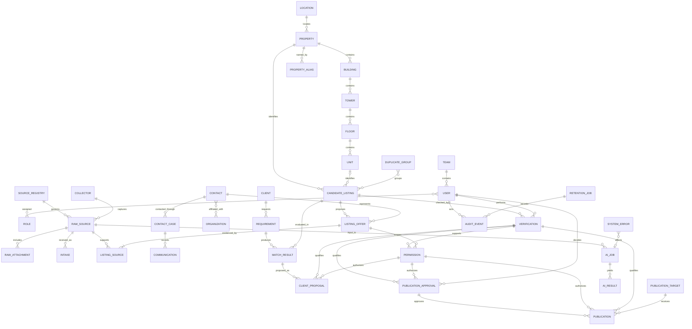

# Entity Relationship Model

| 항목 | 값 |
|---|---|
| Document ID | DOC-DATA-003 |
| 문서 버전 | v1.0 |
| 상태 | FROZEN |
| 소유 역할 | Database Reviewer |
| 기준일 | 2026-07-13 |
| Authority | [Project Constitution](../book-0/00_PROJECT_CONSTITUTION.md) |

이 ER model은 logical cardinality와 authority reference를 설명한다. 구현 table, column type, join strategy 또는 migration이 아니다.

## Entity Relationship Diagram

## Primary relationship rules

| Relationship | Cardinality | Ownership/reference rule |
|---|---|---|
| Team–User | Team 1:N User; future multi-team is OPEN | User identity remains stable when team changes; membership history retained |
| User–Role | M:N | assignment has scope, effective period, grantor and audit; Role is policy reference |
| Source Registry–Raw Source | 1:N | every Raw Source references capture-time source policy/version |
| Raw Source–Attachment | 1:N | attachment cannot exist without source evidence owner; object may be externalized but reference remains |
| Raw Source–Intake | 1:N | each Intake binds source policy/evidence version and records validation/review disposition; it grants no external authority |
| Property hierarchy | Location 1:N Property; Property 1:N Building; Building 1:N Tower; Tower 1:N Floor; Floor 1:N Unit | missing hierarchy levels allowed only with explicit unknown/not-applicable semantics |
| Property/Unit–Candidate | Property 1:N; Unit optional 1:N | candidate may be property-level until unit is resolved; no fabricated Unit |
| Candidate–Offer | 1:N | changing commercial terms creates/versions Offer, not Property/Unit mutation |
| Offer–Listing Source | 1:N minimum one | every offer interpretation has source provenance |
| Duplicate Group–Candidate | M:N | grouping is review evidence; merge does not delete candidate provenance |
| Contact–Offer | 1:N or M:N through scoped relation | contact role, validity and disclosure permission are explicit |
| Contact–Contact Case–Communication | Contact 1:N Case, Case 1:N Communication | purpose, channel, DNC and attempt outcomes remain scoped and audited |
| Client–Requirement | 1:N | original request and structured revisions remain traceable |
| Requirement/Candidate–Match Result | each 1:N | Match Result binds immutable input-version references |
| Match Result–Client Proposal | 1:N | proposal binds exact accepted match/subject versions, audience and sharing Permission |
| Candidate–Verification | 1:N | only latest valid in-scope result may qualify external use; history remains |
| Verification/Offer–Permission | 1:N | permission is independently scoped and may outlive neither its subject nor policy |
| Verification/Permission–Publication Approval | 1:N | approval binds exact representation/target and is a separate human decision |
| Verification/Permission–Publication | 1:N | publication requires valid references to both plus human approval evidence |
| AI Job–AI Result | 1:N | result is advisory and versioned; job failure may yield no result |

## Ownership and reference rules

- Cross-context references use logical primary identifiers; descriptive snapshot은 provenance/version 없이는 authority가 아니다.
- Hard ownership은 parent가 lifecycle boundary를 정의할 때만 사용한다. history/audit/provenance record는 parent soft deletion과 함께 즉시 파괴하지 않는다.
- Optional relation은 missing fact를 의미하며 unknown, not applicable, not yet resolved를 구분한다.
- Polymorphic “anything reference”는 audit/retention처럼 불가피한 경우 target type + stable target identifier + validation rule을 요구한다.
- Circular authority를 금지한다. Publication이 Verification을 증명하거나 Match Result가 Requirement를 승인하는 식의 역전은 허용하지 않는다.

## Reference integrity posture

- active child는 존재하는 canonical parent 또는 approved tombstone을 참조한다.
- merge/supersession은 old→new redirect와 reason/history를 보존한다.
- external identifier는 내부 primary identifier로 사용하지 않고 source/target namespace와 함께 저장한다.
- delete/retention action은 dependent evidence, index, export, attachment와 external publication 영향을 사전 계산한다.

## Open decisions

- Team membership의 M:N 필요 시점
- Property–Building–Tower의 market-specific optionality와 naming
- Permission subject를 Offer/field/representation 중 어디까지 세분화할지
- Audit target reference를 typed registry로 제한할 방식
