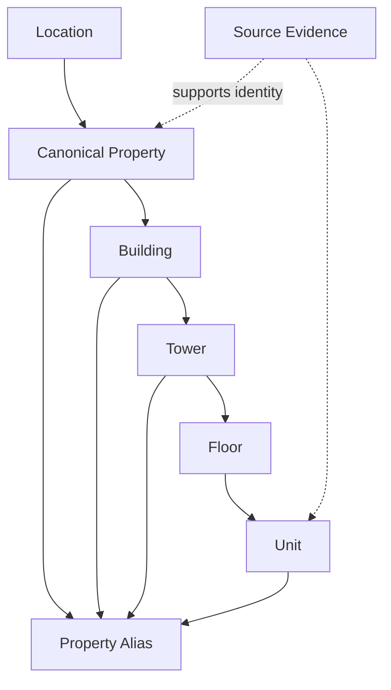

# Property Master Model

| 항목 | 값 |
|---|---|
| Document ID | DOC-DATA-006 |
| 문서 버전 | v1.0 |
| 상태 | FROZEN |
| 소유 역할 | Database Reviewer |
| 기준일 | 2026-07-13 |
| Authority | [Project Constitution](../book-0/00_PROJECT_CONSTITUTION.md) |

## Purpose

Property Master는 physical/canonical identity를 거래 제안과 source post에서 분리한다. completeness보다 근거 있는 identity와 reversible merge/split을 우선한다.

## Property Hierarchy

중간 level이 적용되지 않는 property type은 explicit `not_applicable` semantics로 생략할 수 있다. 알려지지 않은 level을 임의 생성하지 않는다.

## Entity definitions

| Entity | Definition | Authority | Key relationships |
|---|---|---|---|
| Property | 주소·개발 단지·parcel/asset를 포괄하는 canonical top-level property identity | Property Data Steward 승인 master | Location, Building, Alias, Candidate |
| Building | Property 내 구별되는 physical building | Property Master | Property 1:N Building |
| Tower | Building/Property 내 market-relevant tower/block | Property Master | Building 1:N Tower |
| Floor | Tower/Building 내 vertical level identity | Property Master | Tower 1:N Floor |
| Unit | 실제 또는 업무상 식별 가능한 physical unit entity | Property Master; offer authority 아님 | Floor optional parent, Candidate/Offer references |
| Location | hierarchical/geospatial place reference | Location Data Steward | parent location, Property |
| Alias | source/local/language/name variation | Property Data Steward with provenance | one canonical target; source evidence |
| Canonical Property | Property의 active approved identity 상태 | merge/split approval owner | prior/superseded identity history |

## Important attributes

- Property: canonical name, property type, identity confidence, master status, location reference, official/developer references where verified.
- Building/Tower/Floor/Unit: parent reference, canonical label/number, normalized sort representation, status, ambiguity indicator.
- Location: location type, canonical name, parent, normalized address components, optional geo representation and precision.
- Alias: alias text, language/script, target entity/type, source, validity, alias type and confidence.

These are logical attributes, not columns or vendor types.

## Canonicalization rules

- AI may suggest identity/alias but authorized human/application validation creates or changes canonical master.
- address/name similarity alone cannot merge entities.
- unique-looking unit label is scoped to its hierarchy and does not become a global identifier.
- official identifier, developer reference, geospatial evidence와 source agreement improve evidence but do not erase conflict.
- unknown property may remain unresolved while Candidate retains raw provenance.

## Merge, split and correction

| Action | Required evidence | Downstream behavior |
|---|---|---|
| Merge | duplicate rationale, reviewer, source comparison, winning canonical ID | old IDs superseded; candidates/offers/history relinked without provenance loss |
| Split | evidence that one master represented multiple physical entities | new IDs, scoped reassignment, affected verification/publication review |
| Rename | authoritative/local naming evidence | alias/history preserved; stable ID retained |
| Move/correct location | evidence and impact review | geo/search reindex; active offer/verification review if material |

## Constraints

- Property, Unit and Listing Offer are never the same entity.
- one Unit may have multiple concurrent/historical Offers and Contacts.
- canonical merge cannot collapse distinct Offer terms or source records.
- physical deletion of referenced master is not default; retire/supersede preserves history.

## Privacy and retention

Property master is generally business/internal data, but exact residential unit/address, occupancy or owner linkage may be restricted. privacy class is field/entity-context dependent. canonical master is retained while active references exist; superseded identity retention follows audit/provenance policy.

> **OPEN DECISION:** Philippine address hierarchy, parcel/project identifier sources, floor/unit conventions, geo precision and canonical merge approver.

