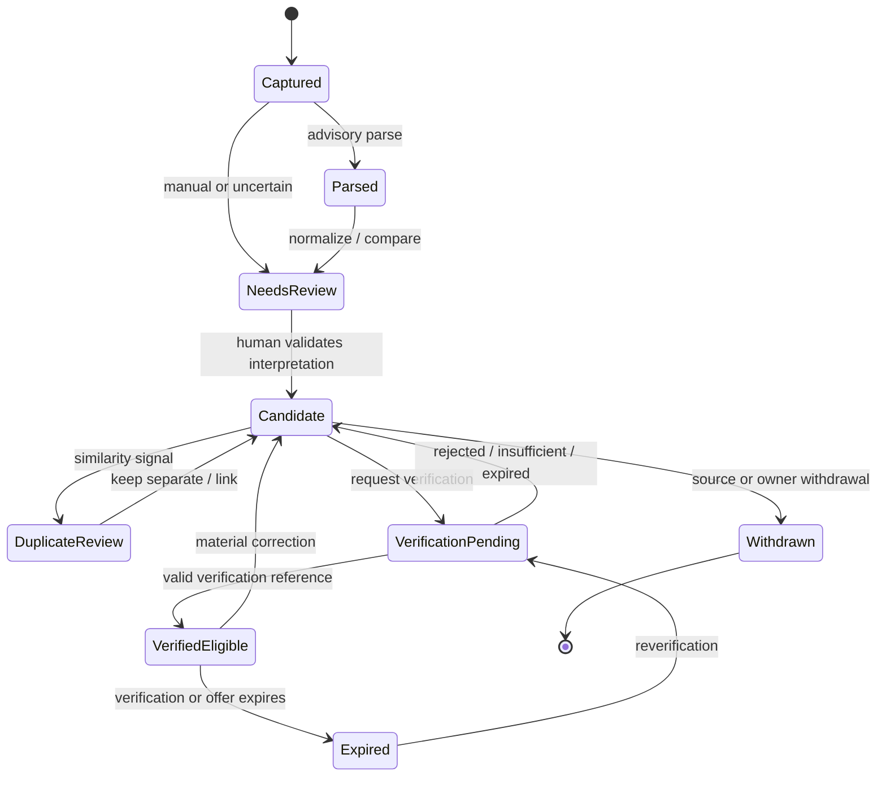

# Candidate and Offer Model

| 항목 | 값 |
|---|---|
| Document ID | DOC-DATA-007 |
| 문서 버전 | v1.0 |
| 상태 | FROZEN |
| 소유 역할 | Database Reviewer |
| 기준일 | 2026-07-13 |
| Authority | [Project Constitution](../book-0/00_PROJECT_CONSTITUTION.md) |

## Separation model

- Candidate Listing: 내부에서 조사·검토하는 property opportunity interpretation.
- Listing Offer: 특정 property/unit에 대한 가격, 거래 유형, 조건, contact와 유효기간의 제안.
- Listing Source: Candidate/Offer claim을 Raw Source에 연결하는 provenance relationship.
- Availability: 특정 Offer의 특정 시점 가용성 주장/검증 view.
- Duplicate Group: same/different 판단을 위한 review grouping; destructive merge가 아님.

## Listing Lifecycle

`VerifiedEligible` is not Published. Publication is a separate entity/lifecycle in [Publication Model](11_PUBLICATION_MODEL.md).

## Logical entities

| Entity | Important attributes | Ownership and authority |
|---|---|---|
| Candidate Listing | property/unit references, candidate status, interpretation revision, unresolved/conflict markers, freshness view | Listing Data Owner; CANDIDATE authority only |
| Listing Offer | transaction type, price/budget-compatible terms, availability claim, effective period, contact relation, offer revision | Listing Data Owner; candidate until Verification exists |
| Listing Source | raw source reference, supported claims/fields, observed time, source role, lineage | provenance evidence only |
| Duplicate Group | group status, matching rationale, confidence, reviewer disposition, merge/split references | Duplicate Review Owner; advisory until human disposition |
| Availability | offer reference, status, as-of time, evidence/verification reference, expiry | Verification Owner when verified; source claim otherwise |

## Candidate rules

- Candidate requires at least one Listing Source or documented authorized manual origin.
- normalization does not overwrite raw value; raw, normalized and human-corrected lineage remain distinguishable.
- unresolved property/unit is allowed and explicitly marked; fabricated master relation is prohibited.
- candidate status alone cannot assert verification, permission or publication.

## Offer rules

- property/unit identity change and commercial term change are different revisions.
- multiple Offers for one Unit are expected when contact, price, terms, source or period differ.
- price/currency/frequency and included/excluded conditions are conceptually bundled to avoid misleading comparisons; exact monetary model is `OPEN DECISION`.
- availability is time-bound and source-reported availability is not verified availability.

## Duplicate model

Duplicate assessment distinguishes:

1. same Raw Source/repost,
2. same Candidate interpretation,
3. same physical Unit but different Offer,
4. same Offer observed through multiple Sources,
5. false positive similarity.

Merge never deletes Raw Source, Listing Source, Offer history, reviewer rationale or old identifiers. Automatic similarity can create a suggestion/group but cannot finalize merge/split.

## Lifecycle constraints

- correction after verification marks affected Verification/Permission/Publication for scope review.
- withdrawal/expiry prevents new external use but keeps historical publication/audit evidence under policy.
- soft deletion hides inactive Candidate from normal search; retention process decides final content disposition.
- stale status is a computed policy view and must reference as-of time/policy version.

## Database capabilities

- `DB-003`: candidate, verification, permission and publication lifecycles are independent.
- `DB-007`: property/unit/offer/source identity and duplicate disposition preserve provenance.
- `DB-011`: availability must include authority, as-of time and expiry/freshness semantics.

> **OPEN DECISION:** exact candidate/offer state vocabulary, monetary/fee model, duplicate reviewer role and offer freshness period by category.

