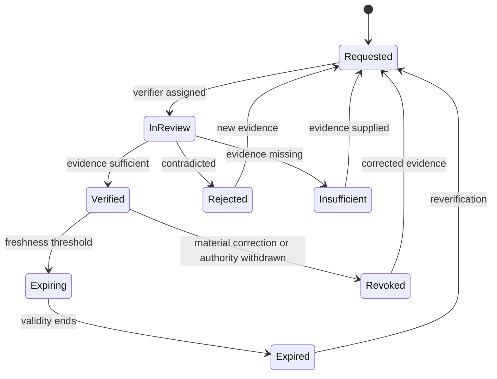

# Verification and Permission Model

| 항목 | 값 |
|---|---|
| Document ID | DOC-DATA-011 |
| 문서 버전 | v1.0 |
| 상태 | FROZEN |
| 소유 역할 | Verification Owner / Security Reviewer |
| 기준일 | 2026-07-13 |
| Authority | [Project Constitution](../book-0/00_PROJECT_CONSTITUTION.md) |

## Separation rule

Verification answers “what was checked, by whom, against which evidence, at what time and scope?” Permission answers “who allows which use, for whom, where and until when?” Neither implies the other.

## Verification Lifecycle

## Entities

| Entity | Purpose | Important logical attributes | Authority |
|---|---|---|---|
| Verification | time/scope-bound human fact decision | subject/type, subject revision, scope/fields, result, evidence references, verified/expiry times, rationale | authorized human verifier |
| Verifier | User/role/team context performing review | user, role/scope, team, effective assignment, qualification evidence if required | Identity/Authorization reference |
| Permission | explicit allowed use | subject/revision, permission type, purpose, audience/target, grantor, scope, effective/expiry, evidence, status | authorized grantor/approver |
| Publication Permission | Permission subtype for public target/use | target/channel scope, allowed representation/fields, approval evidence, expiry/revocation | authorized human; never AI/connector |
| Reverification Request | task/evidence that a prior verification needs renewal | trigger, due time, subject, prior verification, assignee, outcome | Verification workflow |

## Verification rules

- verification references exact Candidate/Offer/property facts and evidence versions.
- field/scope not checked remains unverified; one verified field does not verify the whole record.
- verifier identity, authorization at decision time, method, timestamp, rationale and expiry are required.
- self-verification/separation-of-duty rules depend on risk and are `OPEN DECISION`.
- material change, expiry, source contradiction or withdrawal invalidates affected scope and triggers reverification.

## Permission rules

| Permission type | Allowed purpose | Must not imply |
|---|---|---|
| INTERNAL_ACCESS | restricted internal use | client sharing or publication |
| CLIENT_SHARING | defined client/audience sharing | public publication |
| PUBLIC_PUBLICATION | defined public target/representation | factual verification or successful publication |
| CONTACT_DISCLOSURE | scoped contact disclosure | listing/publication permission |

- grantor authority evidence and revocation route are required.
- permission can be narrower/shorter than verification and can expire independently.
- permission change does not rewrite verification history.
- target, audience, fields/representation and purpose must be specific enough to enforce.

## Eligibility rule

External use requires at minimum:

`valid subject revision + valid in-scope Verification + correct active Permission + authorized human approval + provenance + auditability`

Publication record references these evidence IDs; it does not copy a boolean “verified/publishable” as permanent truth.

## Expiration and reverification

- expiry is explicit or derived from versioned policy and evidence type.
- scheduler may create a Reverification Request but cannot extend verification.
- expiration blocks new external use; active publication enters review/withdrawal flow according to policy.
- reverification creates a new decision linked to the prior one.

## Constraints and capabilities

- `DB-003`, `DB-006`: verification, permission and publication remain separate and all gates are required.
- `DB-004`: every decision/transition is auditable.
- `DB-005`: AI/connector/service identity cannot be Verifier or permission grantor for human-authority decisions.
- valid current status is computed from decision, scope, subject version, effective period and revocation—not a standalone uncontrolled flag.

## Privacy and retention

verification/permission evidence may contain contact or identity proof and is restricted. retain for operational, dispute and audit purpose under defined policy; minimize copied content and preserve revocation/deletion impact.

> **OPEN DECISION:** field-level granularity, freshness periods, qualified verifier roles, self-approval restrictions, permission grantor evidence and two-person approval triggers.

