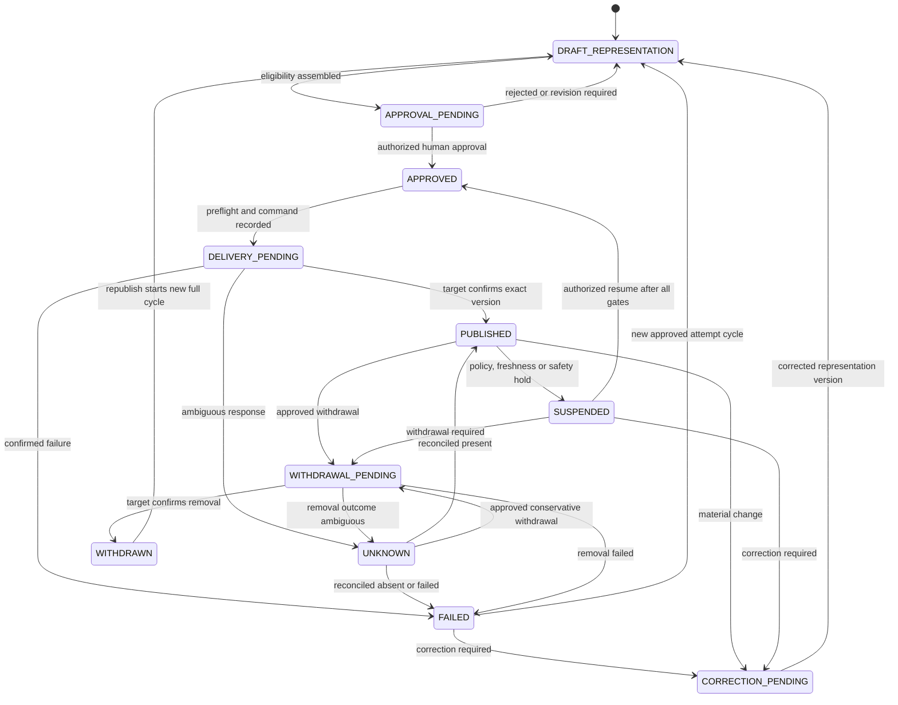

# Publication Model

| 항목 | 값 |
|---|---|
| Document ID | DOC-DATA-012 |
| 문서 버전 | v1.0 |
| 상태 | FROZEN |
| 소유 역할 | Publication Owner |
| 기준일 | 2026-07-13 |
| Authority | [Project Constitution](../book-0/00_PROJECT_CONSTITUTION.md) |

## Purpose

Published Listing을 property/candidate/verification과 분리된, target-scoped external representation 및 delivery history로 모델링한다. publication status는 외부 시스템과 reconciliation 가능한 운영 상태이며 사실 authority가 아니다.

## Publication Lifecycle

## Entities

| Entity | Purpose | Important logical attributes | Authority |
|---|---|---|---|
| Publication | one approved representation sent to one target | subject/revision, representation version, target, verification/permission/approval refs, operation identity, current status, external ref | Publication Owner; delivery authority only |
| Published Listing view | successful external representation projection, not a separate canonical entity | publication ID, published version/time/location, represented fields, external status | derived read-only from confirmed Publication |
| Publication Target | governed destination/channel | target type/name, contract/policy version, allowed fields/use, status, reconciliation capability | Integration/Business Owner |
| Status History / Audit Event | append-oriented attempt/status/correction/withdrawal evidence | prior/new state, attempt, response category, actor/job, reason, correlation, time | Audit/Publication Owner |
| Publication Approval | human approval entity linked to exact representation and target | approver, role/scope, representation hash/version, decision/time/reason/expiry | authorized human only |

## Canonical publication states

| Status | Meaning |
|---|---|
| `PUBLICATION.DRAFT_REPRESENTATION` | 게시 표현 초안이며 승인되지 않음 |
| `PUBLICATION.APPROVAL_PENDING` | exact representation/target의 사람 승인 대기 |
| `PUBLICATION.APPROVED` | 해당 버전·대상에 한해 delivery 가능 |
| `PUBLICATION.DELIVERY_PENDING` | 외부 전달 또는 확인 진행 중 |
| `PUBLICATION.PUBLISHED` | exact version의 외부 존재가 확인됨 |
| `PUBLICATION.UNKNOWN` | 외부 결과가 불명확하여 fail closed 상태 |
| `PUBLICATION.FAILED` | 전달 또는 철회 실패가 확인됨 |
| `PUBLICATION.SUSPENDED` | 정책·최신성·안전 사유의 내부 hold; 외부 제거 확인은 아님 |
| `PUBLICATION.CORRECTION_PENDING` | 새 representation correction 필요 |
| `PUBLICATION.WITHDRAWAL_PENDING` | 승인된 외부 철회 확인 중 |
| `PUBLICATION.WITHDRAWN` | 외부 제거가 확인됨 |

이 집합은 [Workflow Status Dictionary](../book-5/13_STATUS_DICTIONARY.md)의 canonical source와 동일하다. Publication Approval의 거절은 `PUBLICATION_APPROVAL.REJECTED`이며 Publication aggregate에 별도 `REJECTED` 상태를 만들지 않는다.

## Representation rules

- publication snapshot references exact Property/Candidate/Offer revision and shows only approved fields.
- contact fields are excluded unless separate disclosure permission explicitly authorizes them.
- every representation maintains provenance to source and transformation/verification evidence.
- approval is bound to target, representation version and scope; material change invalidates reuse.

## Status and reconciliation

- `PUBLICATION.PUBLISHED` requires target confirmation or approved reconciliation evidence; timeout is `PUBLICATION.UNKNOWN`, not success.
- retry uses stable operation identity and checks existing external state to avoid duplicate publication.
- external response cannot silently rewrite internal verification/permission.
- target capability absence is explicit; rbs-homes API remains an `ASSUMPTION` until contract evidence exists.

## Rollback, correction and withdrawal

“Rollback” means a governed compensating publication/withdrawal, not deletion of history. correction creates a new representation version linked to the prior publication. withdrawal preserves why/when/who and external confirmation. inability to withdraw is a blocking target risk before publication launch.

## Constraints

- `DB-006`: Publication cannot be eligible without valid Verification, public Permission, human Approval, provenance and audit reference.
- Verified is not Published; Approved is not externally Published; request success is not target confirmation.
- revoked/expired evidence blocks new delivery and triggers active-publication review.
- publication history is append-oriented and follows retention/legal hold policy.

## Privacy and retention

retain only the approved representation plus required response/evidence. restricted source/contact data is not copied into publication history. published content may persist externally after internal withdrawal; unresolved residual exposure is tracked as System Error/incident.

> **OPEN DECISION:** rbs-homes contract, target status mapping, correction/withdraw SLA, representation approval granularity and publication evidence retention.
