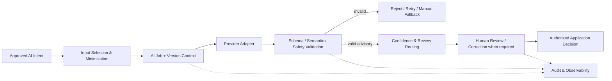

# AI Overview

| 항목 | 값 |
|---|---|
| Document ID | DOC-AI-002 |
| 문서 버전 | v1.0 |
| 상태 | FROZEN |
| 소유 역할 | AI Reviewer |
| 기준일 | 2026-07-14 |
| Authority | [Project Constitution](../book-0/00_PROJECT_CONSTITUTION.md) |

## AI objectives

- raw listing content의 반복적인 field extraction과 normalization effort 감소
- property alias/identity와 duplicate candidate 검토를 위한 explainable suggestion 제공
- client requirement를 구조화하고 relevant candidate search/matching을 지원
- unknown, ambiguity, conflict와 confidence를 숨기지 않는 review-ready output 생성
- human correction, quality, latency, failure와 cost를 측정해 controlled improvement 지원

## AI scope and responsibilities

| Capability | AI responsibility | Application/human responsibility |
|---|---|---|
| Listing Parser | source-bounded field proposal, evidence pointer, uncertainty | schema/semantic validation, human correction, Candidate creation |
| Property Normalization | canonical candidate/alias/location suggestion | master lookup, ambiguity resolution, canonical merge/create approval |
| Duplicate Detection | pair/group similarity, reasons, merge/separate recommendation | human disposition and provenance-preserving merge/split |
| Requirement Parser | original wording에서 budget/location/type/preference/constraint proposal | client clarification, hard/soft confirmation, active Requirement revision |
| Matching/Ranking | eligible input에 대한 score/rank/explanation proposal | eligibility gate, shortlist judgment, client communication |
| Natural-language Search | read-only search intent/filter interpretation | authorization, query bounds, canonical search, result disclosure |
| Confidence/Validation support | uncertainty signal and model-output consistency metadata | deterministic contract/business/security validation and routing |

## AI limitations

- incomplete/stale/malicious source로부터 truth, permission, ownership 또는 availability를 확정할 수 없다.
- confidence는 probability of truth, verification, permission, suitability 또는 publication readiness가 아니다.
- model output은 동일 입력에도 달라질 수 있고 provider/model/prompt 변경에 민감하다.
- local naming, multilingual ambiguity, implied budget/terms와 relationship context를 오해할 수 있다.
- training cutoff/provider knowledge를 current market fact나 legal advice로 사용하지 않는다.
- AI는 human approver, verifier, permission grantor 또는 canonical Data Owner가 아니다.

## AI lifecycle

1. approved capability/purpose and data policy select the minimum input.
2. AI Job binds input references/versions, provider intent, prompt/config version and correlation.
3. provider adapter returns untrusted output.
4. deterministic schema, semantic, security and authority validation runs before persistence/use.
5. confidence and risk route output to accept-as-draft, mandatory human review, reject or manual fallback.
6. authorized application/human action creates any business state; AI Result remains advisory evidence.
7. evaluation/observability measures quality, corrections, failures, latency and cost by version/cohort.

## Non-goals

- autonomous verification, permission, publication, contact disclosure or client decision
- direct database write by provider/model
- prompt content for production, model training pipeline or fine-tuning implementation
- provider/vendor commitment or API endpoint
- current Phase 5에서 agentic source browsing/account control

## Success and safety balance

AI value is measured with correction rate, field quality, duplicate precision/recall, match usefulness and staff-time outcomes alongside provenance, unauthorized action count, privacy leakage, validation rejection and fallback success. speed/cost improvement cannot weaken mandatory controls.

