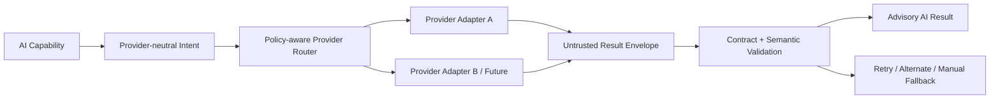

# Provider Abstraction

| 항목 | 값 |
|---|---|
| Document ID | DOC-AI-004 |
| 문서 버전 | v1.0 |
| 상태 | FROZEN |
| 소유 역할 | AI Reviewer / Architecture Owner |
| 기준일 | 2026-07-14 |
| Authority | [Project Constitution](../book-0/00_PROJECT_CONSTITUTION.md) |

## Provider abstraction layer

Core capability submits a provider-neutral `AI Intent` containing capability ID, input references/approved projection, output schema ID/version, quality/safety policy, timeout class and correlation. Adapter maps it to provider behavior and returns a provider-neutral result envelope. Domain modules do not depend on vendor-specific response objects.

## Supported providers

| Support status | Meaning | Current state |
|---|---|---|
| APPROVED | contract, privacy/security, capability/evaluation and operations gates passed | None |
| CANDIDATE | evaluation may be performed with approved non-production data | **OPEN DECISION:** no named provider selected |
| DISABLED | adapter exists conceptually/technically but may not receive traffic | none documented in this phase |
| RETIRED | historical jobs remain reproducible but no new use | none |

Phase 5 supports provider **capability classes**, not named commercial vendors: structured generation, optional embeddings/similarity and optional reranking. A provider is usable only when each requested capability/data class is separately approved.

## Model independence

- model/provider ID and version are runtime evidence, not domain logic.
- output schema, semantic rules, confidence interpretation and evaluation criteria belong to AI MLS capability contracts.
- provider-specific strength may be used behind declared capability flags; silent fallback to incompatible behavior is prohibited.
- switching provider does not claim result equivalence and triggers comparative evaluation.

## Provider selection principles

| Dimension | Required evidence |
|---|---|
| Capability | structured-output adherence, language/local-name handling, context/size limits |
| Quality | versioned evaluation by capability and risk cohort |
| Privacy/security | data use/retention, subprocessor/region, access/security controls, deletion route |
| Reliability | latency, error/rate limits, incident/status and predictable failure behavior |
| Cost | unit/capability cost, budget controls, anomalous usage detection |
| Portability | adapter complexity, export/replay evidence, schema compatibility |
| Governance | owner, approved model versions, change notice, disable/rollback path |

## Fallback strategy

1. validate whether retry is safe and input/policy remains current.
2. bounded retry for transient failure using same operation/correlation.
3. alternate approved model/provider only if data class, capability and evaluation compatibility permit.
4. deterministic non-AI extraction/search where defined.
5. manual intake/review with source evidence.

Fallback never lowers validation, exposes more data, invents missing output or turns failure into success. Provider switching is recorded and confidence/comparability limitations are shown.

## Future provider expansion

New adapter requires CR/decision or ADR triage, data-flow/security/privacy review, contract tests, capability evaluation, cost/operations owner, rollback and historical evidence compatibility. Fine-tuned/self-hosted models are future provider types, not exceptions to governance.

## Failure isolation

provider outage or unsafe output affects only AI Job/capability queue. canonical data, manual workflow and human approval remain available. credential, quota and circuit/disable state are provider-scoped.

> **OPEN DECISION:** initial provider/model, routing rules, capability flags, fallback compatibility, data residency and provider evaluation gate.

