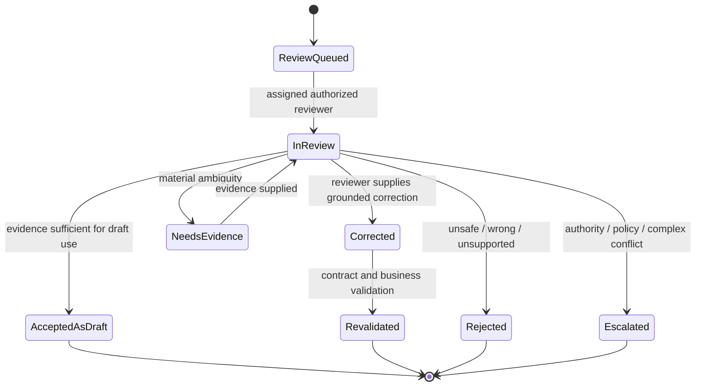

# Human Review

| 항목 | 값 |
|---|---|
| Document ID | DOC-AI-012 |
| 문서 버전 | v1.0 |
| 상태 | FROZEN |
| 소유 역할 | AI Reviewer / Business Owner |
| 기준일 | 2026-07-14 |
| Authority | [Project Constitution](../book-0/00_PROJECT_CONSTITUTION.md) |

## Review workflow

Acceptance means only the capability-specific draft is usable. Verification, Permission, Publication Approval and canonical master change remain separate workflows.

## Review context

Reviewer receives capability, purpose, input/evidence references and versions, structured output, confidence/reasons, provider/model/config versions, validator findings, ambiguity/conflict, prior corrections and downstream impact. UI details are deferred to Book 7.

## Approval boundary

| Reviewed AI output | Permitted reviewer outcome | Separate authority still required |
|---|---|---|
| Listing parse | accept/correct Candidate proposal | Candidate create/update authorization; Verification for facts |
| Normalization | select/reject candidate mapping | Property Data Steward for create/merge/split |
| Duplicate result | recommend disposition | authorized duplicate merge/split decision |
| Requirement parse | confirm/correct structured draft | Client/authorized staff activates revision |
| Match/rank | shortlist/reorder/reject with reason | external eligibility and client-sharing permission |
| Search interpretation | confirm filters/clarify | application authorization and result policy |

## Correction workflow

- correction records reviewer, time, reason/category, original/result versions and grounded value/evidence.
- original AI Result remains; corrected business revision is separate.
- material correction re-runs deterministic validation and invalidates stale downstream results.
- sensitive correction content follows data minimization and access policy.

## Learning feedback

Correction/accept/reject may be evaluation feedback only after purpose, data class, consent/legal basis, retention and quality review. It is not automatically provider training consent. Feedback dataset uses minimized/pseudonymized references where possible and has version/provenance.

## Escalation

Escalate canonical identity conflict, suspected injection/privacy leak, repeated systematic error, high-impact low confidence, discriminatory/prohibited factor, unsupported language/domain, reviewer disagreement and policy/authority uncertainty. Named specialist/owner and SLA are `OPEN DECISION`; unresolved critical finding blocks use.

## Reviewer governance

- reviewer role/scope and current authorization are checked at decision time.
- AI provider/model cannot be reviewer.
- self-review/separation of duties depends on risk; publication/permission gates cannot be collapsed into AI review.
- reviewer workload, disagreement and override patterns are monitored for automation bias and quality.

## Audit and metrics

queue age, review time, outcome, correction type, reviewer agreement, escalation, sampled audit, downstream reversals and feedback use are recorded without copying unnecessary raw content.

> **OPEN DECISION:** capability-specific reviewer roles, sampling, separation of duties, escalation SLA and feedback-data approval.

