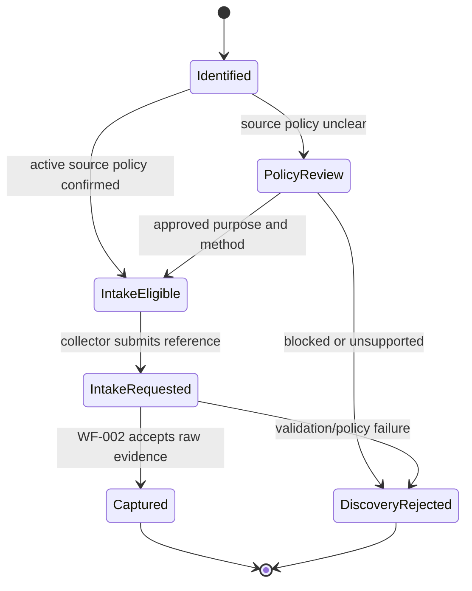

# Listing Discovery Workflow

| 항목 | 값 |
|---|---|
| Document ID | DOC-WF-002 |
| Workflow ID | WF-001 |
| 문서 버전 | v1.0 |
| 상태 | FROZEN |
| 소유 역할 | Source Policy Owner / Collector Lead |
| 기준일 | 2026-07-14 |
| Authority | [Project Constitution](../book-0/00_PROJECT_CONSTITUTION.md) |

## Purpose

Approved source에서 potential listing evidence를 발견하고, policy와 provenance를 확인해 Manual Intake로 전달한다. Discovery는 사실 검증이나 listing authority가 아니다.

## Discovery sources

| Source class | Phase 6 handling | Constraint |
|---|---|---|
| Staff-observed approved website/channel | allowed manual discovery | active Source Registry policy and permitted use |
| Direct owner/broker/developer communication | allowed with identity/context evidence | authority/permission still separately verified |
| Internal historical record | allowed reference | freshness, original provenance and retention |
| User-provided document/message | allowed manual intake after privacy/policy validation | untrusted content, minimization and consent/purpose |
| Automated connector/collector | POST-MVP only when separately approved | isolated intake; no core/publication bypass |
| Autonomous Facebook/Viber control | prohibited in current scope | no account control/scraping authority |

## Listing Lifecycle

## Responsibilities and checkpoints

| Step | Responsible actor | Checkpoint | Output/status |
|---|---|---|---|
| Identify | Collector persona | source/content appears relevant; no restricted action | `DISCOVERY.IDENTIFIED` |
| Policy check | Collector + Source Policy Owner when unclear | Source Registry active, method/purpose permitted | `POLICY_REVIEW`, `INTAKE_ELIGIBLE` or `REJECTED` |
| Capture request | Collector | minimum source reference, observed time, capture context, privacy warning | `INTAKE_REQUESTED` |
| Intake handoff | Manual Intake owner | accepted operation identity; duplicate request guard | Raw Source draft / `CAPTURED` |

## Human checkpoints

- policy uncertainty, personal/restricted data, contributor authority claim, suspicious/malicious content and new source require human review.
- relevance selection by Collector does not grant verification, permission or publication approval.
- automated discovery candidate, if later approved, still enters the same checkpoint.

## Audit events

`DISCOVERY_IDENTIFIED`, `SOURCE_POLICY_REVIEWED`, `DISCOVERY_REJECTED`, `INTAKE_REQUESTED`, `INTAKE_HANDOFF_ACCEPTED`. Each records actor, source registry/version, source reference, observed time, purpose, decision/reason and correlation without copying unnecessary content.

## Exceptions and recovery

- unavailable source: keep reference/time and close or retry manual check according to policy.
- policy revoked after request: block intake processing and route to Source Policy review.
- duplicate capture request: link to existing Raw Source/intake operation rather than create silent duplicate.
- sensitive data discovered: minimize/quarantine; Security/Privacy review before further AI processing.

## Exit criteria

Only `DISCOVERY.INTAKE_REQUESTED` with active policy and required provenance may enter WF-002. Nothing in WF-001 is client/public eligible.

> **OPEN DECISION:** approved initial source inventory, policy-review SLA, new-source approver and discovery retention.

