# AI Processing Workflow

| 항목 | 값 |
|---|---|
| Document ID | DOC-WF-004 |
| Workflow ID | WF-003 |
| 문서 버전 | v1.0 |
| 상태 | FROZEN |
| 소유 역할 | AI Operations Owner / AI Reviewer |
| 기준일 | 2026-07-14 |
| Authority | [Project Constitution](../book-0/00_PROJECT_CONSTITUTION.md) |

## Purpose

Listing parsing, property normalization, duplicate detection and matching AI capability를 versioned AI Job/Result로 수행하고 validation/confidence에 따라 human review 또는 fallback으로 라우팅한다.

## AI Processing Flow

```mermaid
flowchart LR
    Request["Authorized Capability Request"] --> Queue["AI_JOB.QUEUED"]
    Queue --> Run["AI_JOB.RUNNING"]
    Run --> Parse["Parsing / Requirement Interpretation"]
    Parse --> Normalize["Property Normalization"]
    Normalize --> Duplicate["Duplicate Assessment"]
    Duplicate --> Match["Optional Matching / Ranking"]
    Match --> Validate["Schema + Semantic + Authority + Privacy Validation"]
    Validate -->|"invalid / unknown"| Reject["AI_RESULT.REJECTED"]
    Validate -->|"valid"| Confidence["Confidence Evaluation"]
    Confidence -->|"review required"| Review["AI_REVIEW.IN_REVIEW"]
    Confidence -->|"valid draft route"| Draft["AI_RESULT.VALIDATED"]
    Review --> Correct["Correct / Reject / Escalate"]
    Reject --> Fallback["Retry / Deterministic / Manual Fallback"]
    Correct --> Revalidate["Revalidation"]
    Revalidate --> Draft
```

Capabilities run only when their inputs exist; the diagram is not a mandate to run all four sequentially for every case.

## Processing stages

| Stage | Input | Output | Authority/checkpoint |
|---|---|---|---|
| Job acceptance | capability, input refs/versions, policy/config | `AI_JOB.QUEUED` | authorization/data-class/provider eligibility |
| Execution | minimized content and provider-neutral intent | untrusted result envelope | provider has no business authority |
| Parsing | Raw Source or Requirement | structured proposal | AI-001/AI-004 contract |
| Normalization | parsed raw expressions + master candidates | mapping candidates/ambiguity | AI-002; canonical change prohibited |
| Duplicate | candidate pair/group | relationship/recommendation | AI-003; merge prohibited |
| Matching | active requirement + eligible candidate cohort | match/rank/explanation | AI-005; audience gate outside model |
| Validation | output and exact versions | validated/rejected/quarantined | deterministic validator |
| Confidence | validated fields/result | band/reasons/review route | versioned threshold policy |
| Human review | evidence, output, findings | accepted-as-draft/corrected/rejected/escalated | review is not business approval |

## Statuses

AI Job: `QUEUED`, `RUNNING`, `SUCCEEDED`, `FAILED`, `CANCELLED`, `EXPIRED`. AI Result: `RECEIVED`, `VALIDATED`, `REJECTED`, `CORRECTED`, `SUPERSEDED`. AI Review: `REVIEW_QUEUED`, `IN_REVIEW`, `ACCEPTED_AS_DRAFT`, `CORRECTED`, `REJECTED`, `NEEDS_EVIDENCE`, `ESCALATED`, `REVALIDATED`.

## Confidence evaluation and human review

`UNKNOWN` and policy-blocked `LOW` are rejected from automated use. `MEDIUM`, material/canonical/external-use implications, conflict/sensitive output and sampled `HIGH` require human review. Accepted output remains advisory and requires authorized application transition.

## Failure and retry

transient provider/worker failure permits bounded idempotent retry. schema/authority/privacy violations are terminal/quarantine unless input/config is explicitly corrected. alternate provider requires approved capability/data-class compatibility. final fallback is deterministic/manual.

## Audit events

job enqueue/start/attempt/result, provider/model/prompt/config/schema versions, validation/confidence, fallback, review/correction/escalation and final disposition are linked by correlation. raw sensitive payload is not copied unnecessarily.

## Exit criteria

Only `AI_RESULT.VALIDATED` or `AI_REVIEW.REVALIDATED` advisory output may be considered by downstream authorized workflow. `AI_JOB.SUCCEEDED` alone is insufficient.

> **OPEN DECISION:** capability sequencing, reviewer queues/SLA, retry limits, provider fallback matrix and HIGH sampling rate.

