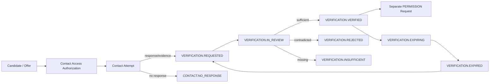

# Contact and Verification Workflow

| 항목 | 값 |
|---|---|
| Document ID | DOC-WF-008 |
| Workflow ID | WF-007 |
| 문서 버전 | v1.0 |
| 상태 | FROZEN |
| 소유 역할 | Verification Owner / Security Reviewer |
| 기준일 | 2026-07-14 |
| Authority | [Project Constitution](../book-0/00_PROJECT_CONSTITUTION.md) |

## Purpose

restricted Contact를 authorized purpose로 사용해 availability/facts를 확인하고, scope/time-bound human Verification과 별도 Permission request를 기록한다.

## Verification Flow

## Contact workflow

- select minimum Contact/Channel with current purpose and role scope.
- authorize access/unmask; record actor, reason and target.
- make human-controlled communication; Phase 6 does not authorize AI impersonation/autonomous messaging.
- record time, direction, purpose, outcome and evidence reference with minimal message content.
- repeated attempts follow approved cadence and consent/channel policy.

Contact statuses: `PENDING`, `CONTACTED`, `NO_RESPONSE`, `INVALID_CHANNEL`, `DO_NOT_CONTACT`, `COMPLETED`. They describe an attempt/case, not Contact entity identity.

## Availability confirmation and verification

Verifier selects exact Candidate/Offer revision and field/scope. Evidence may include authorized contact response, source/official evidence and contradictions. Decision records verifier identity/current scope, method, evidence, result, time, rationale and expiry. Unchecked fields remain unverified.

## Permission request

Verification may trigger but never grants Permission. Separate request specifies `INTERNAL_ACCESS`, `CLIENT_SHARING`, `PUBLIC_PUBLICATION` or `CONTACT_DISCLOSURE`, exact subject/representation, purpose/audience/target, grantor evidence, effective period and revocation. Permission status: `DRAFT`, `UNDER_REVIEW`, `ACTIVE`, `REJECTED`, `EXPIRED`, `REVOKED`, `SUPERSEDED`.

## Expiration

Verification and Permission expire independently. expiry blocks new dependent use and triggers WF-011; it does not erase history. source contradiction/material change may revoke affected Verification immediately.

## Human/authority checkpoints

- restricted contact access and communication purpose
- authorized human verifier and no AI/service substitution
- field/scope evidence sufficiency and freshness
- permission grantor/approver authority separate from verifier
- self-approval/two-person constraints when policy requires

## Audit events

contact access/unmask, attempt/outcome, verification request/review/decision/expiry/revocation, permission request/grant/reject/expiry/revoke, evidence access and reverification trigger.

## Exceptions and recovery

invalid channel/no response remains unresolved; conflict routes to specialist; worker/provider failure cannot fabricate response; permission conflict blocks sharing/publication; accidental disclosure triggers WF-012/security incident.

> **OPEN DECISION:** contact cadence, verifier qualification, field scope, freshness periods, grantor evidence, two-person approval and do-not-contact policy.

