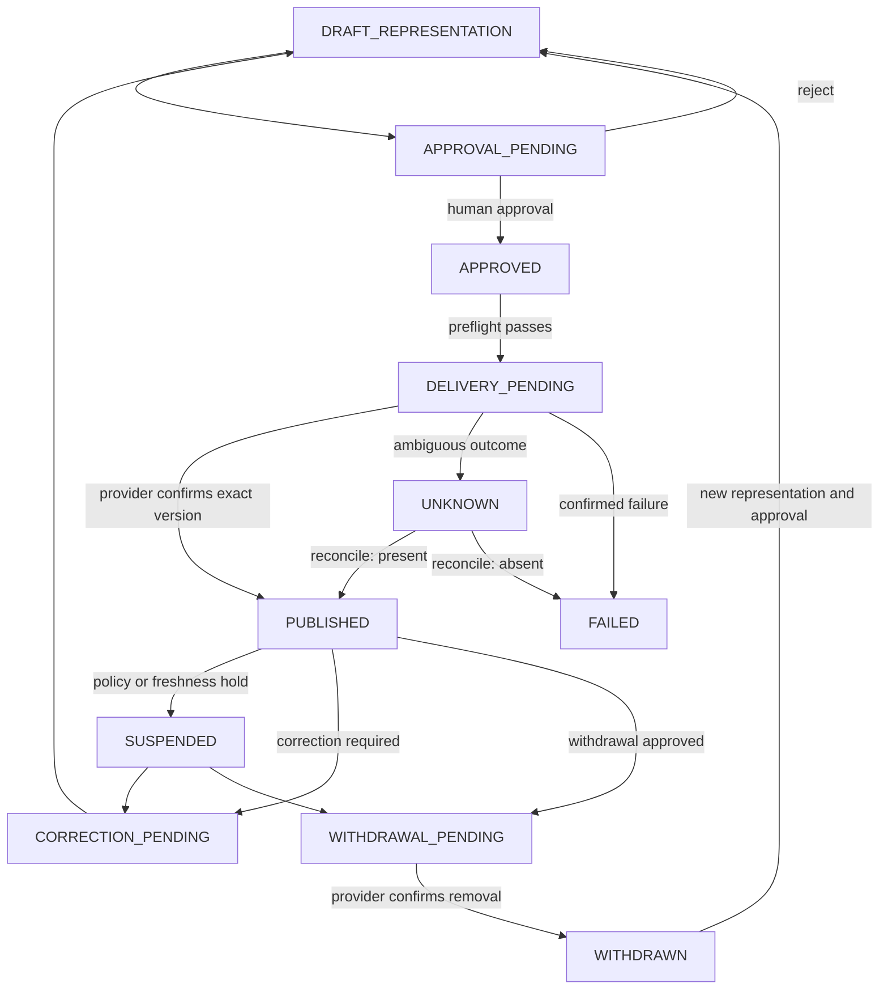

# Publication Workflow

| 항목 | 값 |
|---|---|
| Document ID | DOC-WF-011 |
| 문서 버전 | v1.0 |
| 상태 | FROZEN |
| 소유 역할 | Business Owner / Architecture Owner |
| 기준일 | 2026-07-14 |
| Workflow ID | WF-010 |

## Purpose

승인된 정확한 표현을 지정 대상에 전달하고 외부 상태를 확인한다. 게시·수정·일시중지·철회·재게시는 각각 승인과 감사가 가능한 명령이며, delivery 요청의 성공을 외부 게시 성공으로 간주하지 않는다.

## Publication Flow

## Publish and update

`PUBLICATION_APPROVAL.APPROVED`와 현재 Verification/Permission을 preflight에서 재확인한 뒤 idempotency key와 representation checksum을 가진 delivery를 생성한다. 외부 확인이 정확한 target/version과 일치할 때만 `PUBLISHED`다. 업데이트는 기존 게시물을 암묵적으로 덮지 않고 새 representation, 새 영향 검토 및 필요한 승인을 거친다.

Canonical state set은 `PUBLICATION.DRAFT_REPRESENTATION`, `PUBLICATION.APPROVAL_PENDING`, `PUBLICATION.APPROVED`, `PUBLICATION.DELIVERY_PENDING`, `PUBLICATION.PUBLISHED`, `PUBLICATION.UNKNOWN`, `PUBLICATION.FAILED`, `PUBLICATION.SUSPENDED`, `PUBLICATION.CORRECTION_PENDING`, `PUBLICATION.WITHDRAWAL_PENDING`, `PUBLICATION.WITHDRAWN`이며 [Status Dictionary](13_STATUS_DICTIONARY.md)와 [Publication Model](../book-3/11_PUBLICATION_MODEL.md)에 동일하게 정의된다.

## Suspend, unpublish and republish

- Suspend는 정책·최신성·안전 문제로 추가 노출/업데이트를 막는 내부 hold이며 외부 제거 확인을 뜻하지 않는다.
- Unpublish는 명시적 승인과 provider removal 확인 후 `WITHDRAWN`이 된다.
- Republish는 철회 상태를 되돌리는 단축 경로가 아니다. 새 표현, 유효한 Verification/Permission, 새 승인과 delivery가 필요하다.
- Permission 취소나 Verification 만료는 자동으로 노출을 계속 허용하지 않으며 hold/withdrawal 절차를 촉발한다.

## Failure and reconciliation

Timeout, rate limit, partial response와 중복 callback은 false success를 만들지 않는다. 결과가 불명확하면 `UNKNOWN`으로 fail closed하고 provider 조회/사람 확인으로 조정한다. 재시도는 동일 idempotency key 또는 명시적 successor operation을 사용하며 revoked authority를 복원하지 않는다.

## Audit

Publication/operation ID, approval, representation checksum, target, connector/provider, 요청·응답·callback, actor/job, idempotency key, 상태 전이, 외부 식별자, reconciliation 증거, 정정·철회·재게시 계보를 보존한다.

## Related documents

- [Publication Approval Workflow](09_PUBLICATION_APPROVAL_WORKFLOW.md)
- [Expiration and Reverification](11_EXPIRATION_AND_REVERIFICATION_WORKFLOW.md)
- [Exception and Recovery](12_EXCEPTION_AND_RECOVERY_WORKFLOW.md)
- [State Transition Rules](14_STATE_TRANSITION_RULES.md)
