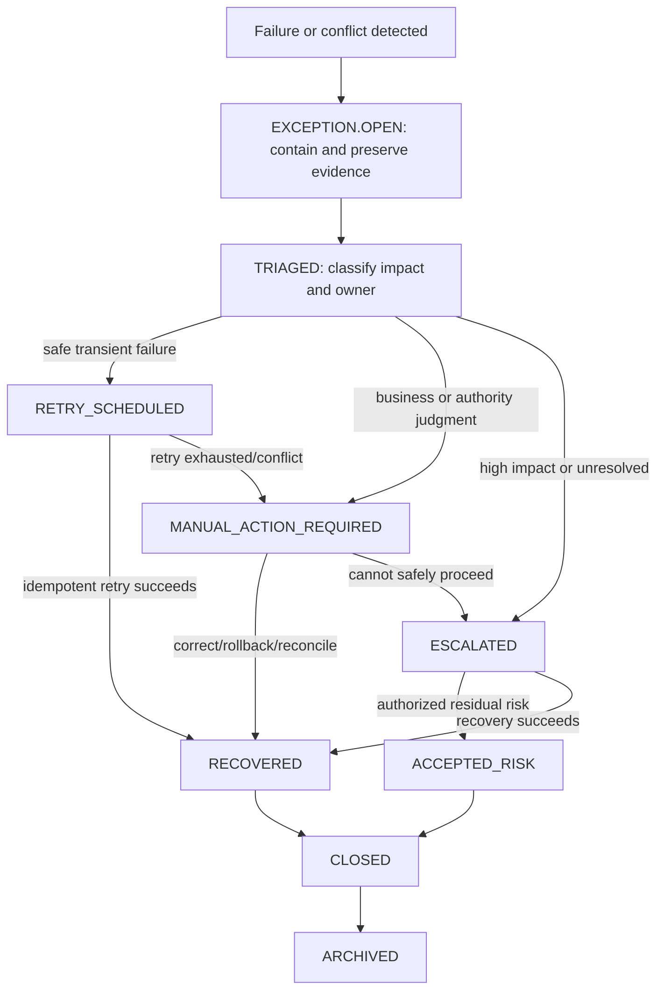

# Exception and Recovery Workflow

| 항목 | 값 |
|---|---|
| Document ID | DOC-WF-013 |
| 문서 버전 | v1.0 |
| 상태 | FROZEN |
| 소유 역할 | Architecture Owner / Business Owner |
| 기준일 | 2026-07-14 |
| Workflow ID | WF-012 |

## Purpose

모든 workflow failure와 policy conflict를 탐지·격리·분류하고, 소유자와 회복/rollback 또는 명시적 terminal disposition을 부여한다. “recoverable”은 모든 작업의 성공 보장이 아니라, 실패가 숨겨지지 않고 안전한 다음 경로를 갖는다는 뜻이다.

## Exception Recovery Flow

## Failure classes and recovery

| Class | Immediate containment | Recovery path | Prohibited shortcut |
|---|---|---|---|
| AI failure/low confidence | Keep result advisory; block downstream acceptance | retry compatible job, manual correction or reject | promote raw output to approved fact |
| Worker/queue failure | Preserve input and idempotency; mark job failed/expired | retry or successor job; reconcile duplicate execution | assume no side effect without evidence |
| Provider/connector failure | mark delivery `FAILED` or `UNKNOWN` | query provider, reconcile, retry safely, manual action | mark published from request acceptance |
| Duplicate conflict | freeze destructive merge/link action | gather evidence, separate/link/merge by reviewer, reopen | silently discard source history |
| Verification/Permission conflict | fail closed and block sharing/publication | human evidence review, new verification/permission | auto-renew or infer consent |
| Publication failure | stop new delivery and preserve external identifiers | reconcile, correct, withdraw or approved retry | direct `FAILED/UNKNOWN → PUBLISHED` without confirmation |

## Triage and authority

Triage records severity, affected records/audience, data/privacy risk, retry safety, owner and target resolution time. Technical owners may contain, retry and reconcile within policy; only the applicable Business/Security/Architecture authority may accept residual risk, override a business conflict or approve corrective external action. AI and connectors cannot close their own exception.

## Rollback and closure

Rollback is a compensating, audited transition: supersede a result, restore pre-merge relationships, revoke approval, correct representation or confirm withdrawal. It never deletes source/audit history. `RECOVERED` requires verification of the intended canonical and external state. `ACCEPTED_RISK` requires named authority, rationale, scope and review/expiry date. `CLOSED` requires impact review and linked evidence; only then may archival occur.

## Audit

Exception ID, detecting actor/job, source workflow/state, correlation/idempotency keys, evidence, containment, severity, owner, attempts, decisions, approvals, affected artifacts, recovery verification, residual risk and closure are mandatory.

## Related documents

- [Audit and History Model](../book-3/12_AUDIT_AND_HISTORY_MODEL.md)
- [Failure Isolation](../book-2/08_FAILURE_ISOLATION.md)
- [Status Dictionary](13_STATUS_DICTIONARY.md)
- [State Transition Rules](14_STATE_TRANSITION_RULES.md)
