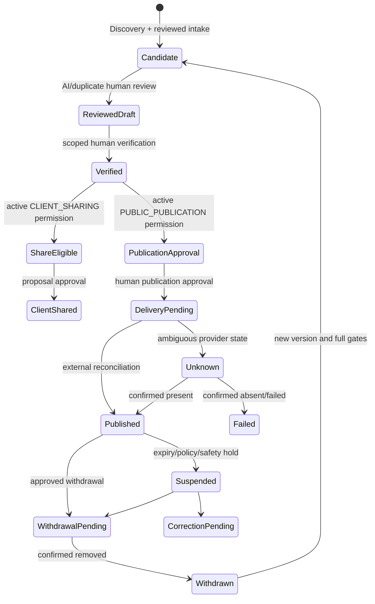

# Workflow State Transition Rules

| 항목 | 값 |
|---|---|
| Document ID | DOC-WF-015 |
| 문서 버전 | v1.0 |
| 상태 | FROZEN |
| 소유 역할 | Architecture Owner / Business Owner |
| 기준일 | 2026-07-14 |

## Purpose

[Status Dictionary](13_STATUS_DICTIONARY.md)의 business states 사이에 허용되는 전이, trigger, authority, approval 및 rollback/recovery를 정의한다. 표에 없는 전이는 금지한다. 모든 전이는 aggregate/version을 잠그고 이전 상태, 새 상태, actor/job, authority context, reason, time, evidence와 correlation ID를 원자적 audit event로 남겨야 한다.

## Global guards

1. Canonical current state와 expected version이 일치해야 한다.
2. Actor/job은 해당 action과 scope에 유효한 authority를 가져야 한다.
3. downstream entry 시 prerequisite를 재검사한다. 과거 승인이나 캐시는 우회 근거가 아니다.
4. AI, worker, connector는 human approval transition을 수행하지 못한다.
5. retry/replay는 idempotent하며 expired/revoked authority를 복원하지 않는다.
6. rollback은 삭제가 아니라 successor, reopen 또는 compensating transition이다.
7. 외부 side effect는 요청 응답이 아니라 reconciliation evidence로 확인한다.

## State Transition Diagram

이 다이어그램은 aggregate 간 gate를 요약하며 Candidate, Verified, Permission, Proposal Approval, Publication Approval과 Published가 서로 다른 권한 상태임을 나타낸다.

## Discovery and intake transitions

| Allowed transition | Trigger | Authority / approval | Rollback or recovery |
|---|---|---|---|
| `DISCOVERY.IDENTIFIED → POLICY_REVIEW` | source 검토 시작 | Collector | exception 후 동일 검토 재개 |
| `POLICY_REVIEW → INTAKE_ELIGIBLE` | 정책/증거 통과 | Policy reviewer | 새 증거 시 새 review event |
| `POLICY_REVIEW → REJECTED` | 금지/부적격 | Policy reviewer | 새 discovery record |
| `INTAKE_ELIGIBLE → INTAKE_REQUESTED` | intake 승인 요청 | Collector Lead | idempotent resend |
| `INTAKE_REQUESTED → CAPTURED` | intake 수락 확인 | Intake owner | linked intake correction |
| `INTAKE_REQUESTED → REJECTED` | intake 거절 | Intake owner | 새 evidence로 새 request |
| `INTAKE.DRAFT → VALIDATED` | validation 통과 | Validator | correction은 새 version |
| `DRAFT → VALIDATION_FAILED` | 규칙 실패 | Validator | draft correction |
| `DRAFT/VALIDATION_FAILED → QUARANTINED` | 정책/안전 위험 | Policy/Security reviewer | review 후 draft 또는 reject |
| `VALIDATION_FAILED/CORRECTED → VALIDATED` | 수정본 통과 | Validator | 반복 가능, version 추적 |
| `QUARANTINED → DRAFT` | 위험 해제 | Policy/Security reviewer | 재검증 필수 |
| `QUARANTINED → REJECTED` | 위험 확정 | Policy/Security reviewer | 새 intake만 허용 |
| `VALIDATED → AI_REQUESTED` | advisory processing 선택 | Authorized operator | job 실패 시 review/manual path |
| `VALIDATED/AI_REQUESTED → REVIEW_REQUIRED` | 수동 또는 AI output 준비 | System/Agent | evidence 요청/정정 |
| `REVIEW_REQUIRED → CORRECTED` | 사람 정정 | Assigned reviewer | 재검증 |
| `REVIEW_REQUIRED → CANDIDATE_REGISTERED` | draft 수락 | Senior Agent human approval | downstream에서 재검사 |
| `REVIEW_REQUIRED → REJECTED` | 부적격 결정 | Assigned reviewer | 새 intake/version |

## AI and duplicate transitions

| Allowed transition | Trigger | Authority / approval | Rollback or recovery |
|---|---|---|---|
| `AI_JOB.QUEUED → RUNNING` | worker lease | Authorized worker | lease expiry reconciliation |
| `QUEUED → CANCELLED/EXPIRED` | cancel/deadline | Job owner / Scheduler | successor job |
| `RUNNING → SUCCEEDED/FAILED/EXPIRED` | persisted outcome/deadline | Worker / Scheduler | late output captured separately; successor job |
| `AI_RESULT.RECEIVED → VALIDATED/REJECTED` | structure/provenance check | Validator | correction/manual review |
| `VALIDATED → CORRECTED/SUPERSEDED` | human correction/new result | Human reviewer | revalidation/link successor |
| `CORRECTED → VALIDATED/REJECTED` | revalidation | Validator | repeat or reject |
| `AI_REVIEW.REVIEW_QUEUED → IN_REVIEW` | reviewer claim | Assigned reviewer | reassignment audited |
| `IN_REVIEW → ACCEPTED_AS_DRAFT/CORRECTED/REJECTED/NEEDS_EVIDENCE/ESCALATED` | human disposition | Human reviewer | no business approval implied |
| `CORRECTED → REVALIDATED` | corrected output passes | Human reviewer + validator | reject/escalate if fail |
| `NEEDS_EVIDENCE → IN_REVIEW/REJECTED` | evidence supplied or unavailable | Human reviewer | reopen via new evidence |
| `ESCALATED → IN_REVIEW/REJECTED` | authorized direction | Architecture/Business Owner | decision evidence required |
| `REVALIDATED → ACCEPTED_AS_DRAFT/REJECTED` | final human disposition | Human reviewer | downstream business review |
| `DUPLICATE.SUGGESTED → IN_REVIEW` | reviewer assigned | Data Steward | preserve suggestion |
| `IN_REVIEW → NEEDS_EVIDENCE/RESOLVED_LINK/RESOLVED_MERGE/RESOLVED_SEPARATE` | human disposition | Reviewer; merge requires Senior reviewer | compensating relation/lineage |
| `NEEDS_EVIDENCE → IN_REVIEW` | evidence supplied | Reviewer | repeat as needed |
| `RESOLVED_LINK/RESOLVED_MERGE/RESOLVED_SEPARATE → REOPENED` | new evidence/downstream conflict | Senior reviewer | preserve prior decision |
| `REOPENED → IN_REVIEW` | review accepted | Data Steward | new disposition |

## Requirement, matching, contact, verification and permission transitions

| Allowed transition | Trigger | Authority / approval | Rollback or recovery |
|---|---|---|---|
| `REQUIREMENT.DRAFT → ACTIVE/WITHDRAWN` | validation+confirmation / cancel | Agent; activation per policy | new version for material correction |
| `ACTIVE → PAUSED/FULFILLED/WITHDRAWN/EXPIRED` | client/business outcome/time | Agent; fulfill requires Senior Agent | successor requirement |
| `PAUSED → ACTIVE/WITHDRAWN/EXPIRED` | resume/cancel/time | Agent/Senior Agent | preserve pause history |
| `MATCH.REQUESTED → RUNNING` | execution claim | Authorized worker | exception/successor match |
| `RUNNING → REVIEW_REQUIRED` | ranked result stored | Matching system | failure via Exception |
| `REVIEW_REQUIRED → REVIEWED/REJECTED` | human review/rejection | Assigned reviewer | new match request |
| `REVIEWED → ACCEPTED/REJECTED` | shortlist disposition | Human reviewer | stale/successor; not Verification |
| `ACCEPTED/REVIEWED → STALE` | input/eligibility changed | System/Human reviewer | new match required |
| `STALE/ACCEPTED/REJECTED → SUPERSEDED` | successor linked | Agent/System | prior result immutable |
| `CONTACT_CASE.PENDING → CONTACTED/NO_RESPONSE/INVALID_CHANNEL/DO_NOT_CONTACT/COMPLETED` | contact outcome | Agent; DNC follows policy | new permitted case only |
| `NO_RESPONSE/INVALID_CHANNEL → PENDING/COMPLETED/DO_NOT_CONTACT` | authorized retry/closure | Agent | attempt limits apply |
| `CONTACTED → PENDING/COMPLETED/DO_NOT_CONTACT` | follow-up/outcome | Agent | preserve all attempts |
| `VERIFICATION.REQUESTED → IN_REVIEW` | verifier claim | Authorized verifier | reassignment audited |
| `IN_REVIEW → VERIFIED/REJECTED/INSUFFICIENT` | evidence disposition | Human verifier | new request/evidence |
| `INSUFFICIENT → IN_REVIEW/REJECTED` | evidence supplied/closed | Human verifier | new request |
| `VERIFIED → EXPIRING/EXPIRED/REVOKED` | policy/time/conflict | Scheduler or Authorized verifier | new Verification only |
| `EXPIRING → VERIFIED` | timely new evidence on new version | Human verifier | link successor; old record retained |
| `EXPIRING → EXPIRED/REVOKED` | deadline/conflict | Scheduler/Verifier | new Verification only |
| `PERMISSION.DRAFT → UNDER_REVIEW` | evidence ready | Agent | revise draft |
| `UNDER_REVIEW → ACTIVE/REJECTED` | explicit grant decision | Authorized human reviewer | new request |
| `ACTIVE → EXPIRED/REVOKED/SUPERSEDED` | time/revocation/successor | Scheduler or Authorized reviewer | new Permission only |

## Proposal and publication transitions

| Allowed transition | Trigger | Authority / approval | Rollback or recovery |
|---|---|---|---|
| `PROPOSAL.DRAFT → REVIEW_PENDING` | prechecks complete | Agent | revision to new draft version |
| `REVIEW_PENDING → APPROVED_TO_SHARE/REVISION_REQUIRED/EXPIRED` | human review/dependency expiry | Senior Agent / Scheduler | new review after revision |
| `APPROVED_TO_SHARE → SHARED/WITHDRAWN/EXPIRED/REVISION_REQUIRED` | send/hold/change | Agent for send; Senior Agent for hold | correction notice/new version |
| `SHARED → FEEDBACK_RECEIVED/WITHDRAWN/EXPIRED/REVISION_REQUIRED` | feedback/change/time | Agent/Senior Agent/Scheduler | notify client/new version |
| `FEEDBACK_RECEIVED → REVISION_REQUIRED/WITHDRAWN` | action decision | Agent/Senior Agent | new proposal version |
| `REVISION_REQUIRED → DRAFT` | revised version created | Agent | full re-review |
| `PUBLICATION_APPROVAL.REQUESTED → UNDER_REVIEW/REJECTED` | approver claim/invalid request | Assigned approver | corrected new request |
| `UNDER_REVIEW → APPROVED/REJECTED` | human decision | Authorized independent approver | new request/version |
| `APPROVED → REVOKED/EXPIRED` | dependency/authority/time change | Approver/Scheduler | new approval required |
| `PUBLICATION.DRAFT_REPRESENTATION → PUBLICATION.APPROVAL_PENDING` | approval request | Requester | revise version |
| `PUBLICATION.APPROVAL_PENDING → PUBLICATION.APPROVED/PUBLICATION.DRAFT_REPRESENTATION` | approval/rejection | Human approver | corrected new version |
| `PUBLICATION.APPROVED → PUBLICATION.DELIVERY_PENDING/PUBLICATION.CORRECTION_PENDING` | preflight+delivery / changed input | Authorized operator / Business Owner | new approval if changed |
| `PUBLICATION.DELIVERY_PENDING → PUBLICATION.PUBLISHED/PUBLICATION.UNKNOWN/PUBLICATION.FAILED` | external confirmation/ambiguity/failure | Connector + reconciler | reconcile or approved retry |
| `PUBLICATION.UNKNOWN → PUBLICATION.PUBLISHED/PUBLICATION.FAILED/PUBLICATION.WITHDRAWAL_PENDING` | reconciliation evidence | Reconciler; withdrawal requires approval | exception if unresolved |
| `PUBLICATION.FAILED → PUBLICATION.CORRECTION_PENDING/PUBLICATION.DRAFT_REPRESENTATION` | failure review/new attempt plan | Business Owner | full gates as affected |
| `PUBLICATION.PUBLISHED → PUBLICATION.SUSPENDED/PUBLICATION.CORRECTION_PENDING/PUBLICATION.WITHDRAWAL_PENDING` | safety/change/approved withdrawal | Business Owner/Human approver | external state reconciled |
| `PUBLICATION.SUSPENDED → PUBLICATION.CORRECTION_PENDING/PUBLICATION.WITHDRAWAL_PENDING/PUBLICATION.APPROVED` | correct/withdraw or valid resume approval | Human approver | preflight and external check |
| `PUBLICATION.CORRECTION_PENDING → PUBLICATION.DRAFT_REPRESENTATION` | corrected version created | Author | full approval |
| `PUBLICATION.WITHDRAWAL_PENDING → PUBLICATION.WITHDRAWN/PUBLICATION.UNKNOWN/PUBLICATION.FAILED` | removal evidence/ambiguity/failure | Connector + reconciler | reconcile/retry |
| `PUBLICATION.WITHDRAWN → PUBLICATION.DRAFT_REPRESENTATION` | republish request | Author | all gates and new approval |

## Reverification and exception transitions

| Allowed transition | Trigger | Authority / approval | Rollback or recovery |
|---|---|---|---|
| `REVERIFICATION.SCHEDULED → REMINDER_DUE/CANCELLED` | due/no longer needed | Scheduler/Task owner | successor task |
| `REMINDER_DUE → REMINDER_SENT/FAILED` | channel result | Scheduler | exception/manual contact |
| `REMINDER_SENT → IN_PROGRESS/FAILED/CANCELLED` | owner claim/delivery failure/closure | Assigned verifier/Task owner | successor task |
| `IN_PROGRESS → COMPLETED/FAILED/CANCELLED` | new verification result/outcome | Human verifier | successor task; no old-state reactivation |
| `EXCEPTION.OPEN → TRIAGED` | impact and owner assigned | Triage owner | preserve containment |
| `TRIAGED → RETRY_SCHEDULED/MANUAL_ACTION_REQUIRED/ESCALATED` | recovery classification | Triage owner | re-triage with reason |
| `RETRY_SCHEDULED → RECOVERED/MANUAL_ACTION_REQUIRED` | verified retry outcome | Technical owner | escalate after limits |
| `MANUAL_ACTION_REQUIRED → RECOVERED/ESCALATED` | correction/reconciliation or impasse | Business/Technical owner | escalation |
| `ESCALATED → RECOVERED/ACCEPTED_RISK` | authority decision | Named Architecture/Business/Security authority | review date may reopen |
| `RECOVERED/ACCEPTED_RISK → CLOSED` | impact/closure review | Workflow owner; accepted risk retains named approval | reopen on new evidence |
| `CLOSED → ARCHIVED` | retention/archive policy | Records custodian | read-only retrieval |
| `CLOSED/ACCEPTED_RISK → OPEN` | new evidence/review breach | Workflow/Architecture Owner | link prior closure |

## Audit evidence transitions

| Allowed transition | Trigger | Authority / approval | Rollback or recovery |
|---|---|---|---|
| `AUDIT_EVENT.APPENDED → CORRECTED` | factual/metadata correction annotation required | Authorized audit custodian | original remains immutable and linked |
| `APPENDED/CORRECTED → ARCHIVED` | approved retention/archive rule | Records custodian | manifest-backed retrieval |
| `APPENDED/CORRECTED/ARCHIVED → DELETED_BY_POLICY` | approved disposition after legal-hold/privacy checks | Authorized retention executor | deletion evidence retained per policy; no silent restore |

## Explicitly forbidden transitions

| Forbidden transition or shortcut | Reason |
|---|---|
| Candidate/intake/AI result → `VERIFICATION.VERIFIED` | candidate and AI advisory are not human verification |
| `AI_REVIEW.ACCEPTED_AS_DRAFT` → any business approval | AI review accepts only a draft |
| `VERIFICATION.VERIFIED` ↔ `PERMISSION.ACTIVE` | truth/freshness and allowed use are independent |
| Match accepted → Proposal shared | valid sharing Permission and human proposal approval are required |
| Verification or Permission active → Publication delivery | exact representation publication approval is required |
| Publication approval → `PUBLICATION.PUBLISHED` | delivery plus external reconciliation is required |
| `PUBLICATION.UNKNOWN/FAILED → PUBLISHED` without evidence | false success risk |
| `EXPIRED/REVOKED → ACTIVE/VERIFIED/APPROVED` | new version/record and fresh approval are required |
| `WITHDRAWN → PUBLISHED` | republish must traverse new representation and all gates |
| Exception/failed record deletion as rollback | audit and evidence chain must remain immutable |

## Concurrency and validation

Optimistic version check 또는 동등한 canonical serialization rule을 요구한다. 충돌한 전이는 성공으로 간주하지 않고 current state를 다시 읽어 재평가한다. State machine validation은 aggregate prefix, allowed edge, guard, authority, approval evidence와 audit completeness를 함께 검사해야 하며 구현 방식은 Phase 6 범위 밖이다.
