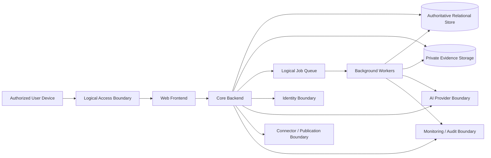

# Deployment Architecture

| 항목 | 값 |
|---|---|
| Document ID | DOC-OPS-002 |
| 문서 버전 | v1.0 |
| 상태 | FROZEN |
| 소유 역할 | Architecture Owner / Operations Owner |
| 기준일 | 2026-07-14 |

## Logical deployment topology

각 node는 logical responsibility이며 process count, region, network product 또는 hosting vendor가 아니다.

## Application tiers

| Tier | Responsibility | Operational posture |
|---|---|---|
| Access/UI | authenticated interaction, safe static delivery, role-aware presentation | stateless/replaceable where possible; no direct data/provider access |
| Core application | authorization, workflow/state, validation, audit orchestration | authoritative write gate; unavailable security/audit means fail closed |
| Worker/job | AI, matching, expiry, retention, publication delivery/reconciliation | isolated, idempotent, bounded retry; queue acceptance ≠ completion |
| Data | relational authority, private evidence, audit/history | consistency/classification/backup/recovery protection |
| Integration | identity, AI, source connector, rbs-homes/external target | circuit/isolation, contract/version, scoped identity, reconciliation |
| Operations | monitoring, logging, alert, deployment/recovery control | separate privileged access and evidence |

## Background workers

Worker는 synchronous API와 같은 domain authorization/workflow guard를 사용한다. Job lease, attempt, idempotency, predecessor/successor, input/output version, owner와 terminal evidence를 유지한다. Poison job은 per-job isolation으로 보내고 human decision이나 revoked authority를 retry로 복원하지 않는다.

## Storage

- relational store: canonical entity/status/history와 transaction integrity.
- private object storage: Raw Attachment/evidence; public serving 금지.
- queue/job store: delivery metadata; business truth 아님.
- logs/metrics: minimized operational evidence; canonical audit 대체 금지.
- backup/archive: source classification, encryption, retention와 recovery authorization 상속.

## External services

Identity, AI provider, source/website connector, publication target와 notification/communication boundary를 external dependency로 관리한다. Health/contract/credential/retry/reconciliation을 분리하고 outage 시 manual/degraded path 또는 fail-closed state를 사용한다.

## Trust boundaries

Device↔access, UI↔core, core/worker↔data, core↔identity, core/worker↔AI, core↔connector/publication, runtime↔operations, primary↔backup/environment boundary마다 authentication, authorization, encryption, validation, classification와 audit를 적용한다.

## Failure isolation

AI/connector/publication/notification failure는 core authority와 분리한다. Data/security/audit uncertainty는 write/privileged operation을 거절한다. Deployment unit 분리는 장애 경계, scaling evidence와 ownership이 입증될 때만 변경하며 modular monolith baseline을 유지한다.

